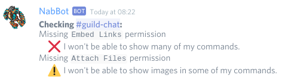

# Admin commands
Commands for server owners and admins.  
Admins are members with the `Administrator` permission.

!!! info
    Parameters are enclosed with `< >`.   
    Optional parameters are enclosed in brackets `[]`.

## addaccount 
**Syntax:** `addaccount <user>,<character>`  
**Other aliases:** `addacc`

Register a character and all other visible characters to a discord user.

If a character is hidden, only that character will be added. Characters in other worlds are skipped.

----

## addchar
**Syntax:** `addchar <user>,<character>`  
**Other aliases:** `registerchar`

Registers a character to a user.

----

## checkchannel
**Syntax:** `checkchannel [channel]`

Checks the channel's permissions.

Makes sure that the bot has all the required permissions to work properly.
If no channel is specified, the current one is checked.

??? Summary "Examples"
    **/checkchannel**  
    

----

## setwelcome
**Syntax:** `setwelcome [message]`

Sets the welcome message new users get when joining a server. By default all members receive the following message: 
****
Welcome to **Server Name**! I'm **NabBot**, to learn more about my commands type `/help`  
Start by telling me who is your Tibia character, say **/im *character_name*** so I can begin tracking your level ups and deaths!
****

This message can only be edited globally in `config.py`, however, this message can be extended for a specific server by using the command.
Using the command with no parameters shows the current welcome message.

??? Summary "Examples"
    **/setwwelcome**   
      
    **/setwelcome *This is an example message***   
    

Note that you can use special formatting to show the current user's name, server name, etc.
For more info, use `/help setwelcome`

----

## removechar
**Syntax:** `removechar <name>`  
**Other aliases:** `deletechar`, `unregisterchar`

Removes a registered character.