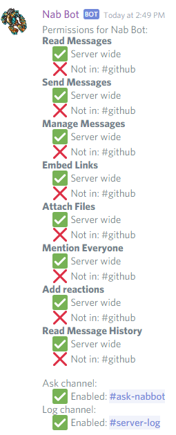
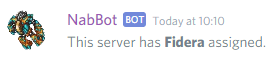
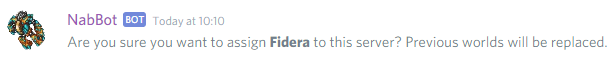
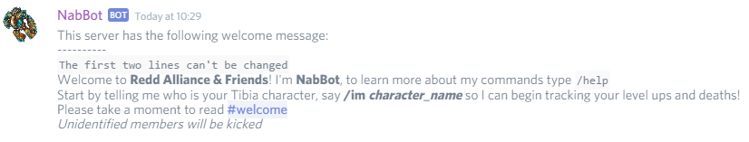
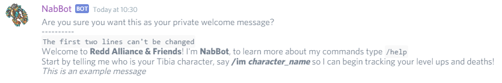
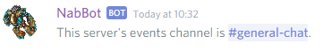
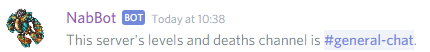
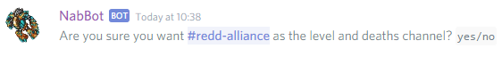

This commands can only be used by the server's owner and users with the `Administrator` permission.

!!! info
    Words in italics are parameters.  
    Parameters enclosed in brackets `[]` are optional.

## /diagnose [*name*]

Checks the server and every channel's permissions to check if the bot has the needed permissions to work correctly.
Also checks if the ask channel and server log channels are set correctly.

If no serverName is specified, it check's the current server.
If a server name is specified, it checks the permissions for that server. 
The command can't be used without a server name on private messages.

Note that you must be the owner of the server in order to check. Bot owner can check any server the bot is in.  

??? Summary "Examples"

    **/diagnose** *(on a server called Nab Bot)*  
    

----

## /setworld [*world*]

Sets the tibia world this server will track. This lets users in this servers add their characters.

If the command is used without a world, the bot will just say which world the server is currently tracking.  
If the command is used with a world, the bot will ask to confirm the change.

??? Summary "Examples"

    **/setworld**   
    
    
    **/setworld Fidera**   
    

----

## /setwelcome [*message*]

Sets the welcome message new users get when joining a server. By default all members receive the following message: 
****
Welcome to **Server Name**! I'm **NabBot**, to learn more about my commands type `/help`  
Start by telling me who is your Tibia character, say **/im *character_name*** so I can begin tracking your level ups and deaths!
****

This message can only be edited globally in `config.py`, however, this message can be extended for a specific server by using the command.
Using the command with no parameters shows the current welcome message.

??? Summary "Examples"

    **/setwwelcome**   
    
    
    **/setwelcome *This is an example message***   
    

Note that you can use special formatting to show the current user's name, server name, etc.
For more info, use `/help setwelcome`

----

## /seteventschannel [*name*]
*Other aliases: /setnewschannel, /seteventschannel*

By default, announcements are made on the highest channel the bot can see. This command can be used to change this channel.

The channel set will be used for event announcements and news announcements. 

When setting a new channel, the bot will check if it has permission to write in there. 
If at some point the channel becomes deleted or unavailable to the bot in some way, it will keep doing announcements in highest channel again.

When it's used with no parameters, it will show the current assigned channel

??? Summary "Examples"

    **/seteventschannel**   
    
    
    **/seteventschannel #redd-alliance**   
    

----

## /setlevelsdeathschannel [*name*]
*Other aliases: /setlevelschannel, /setdeathschannel, /setlevelchannel, /setdeathchannel, /setleveldeathchannel*

By default, announcements are made on the highest channel the bot can see. This command can be used to change this channel.

The channel set will be used for level up and deaths messages. 

When setting a new channel, the bot will check if it has permission to write in there. 
If at some point the channel becomes deleted or unavailable to the bot in some way, it will keep doing announcements in highest channel again.

When it's used with no parameters, it will show the current assigned channel

??? Summary "Examples"

    **/seteventschannel**   
    
    
    **/seteventschannel #redd-alliance**   
    
