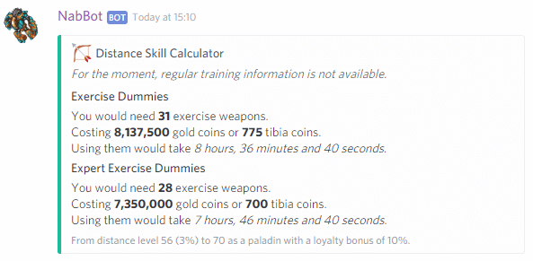
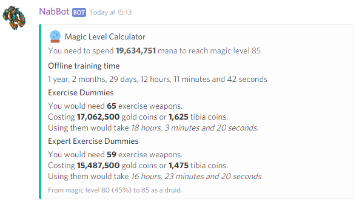
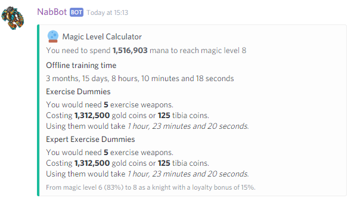
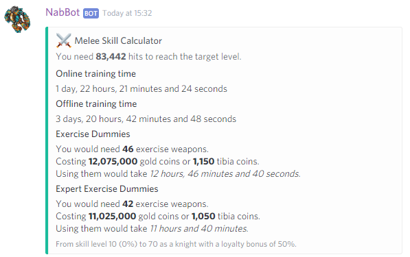
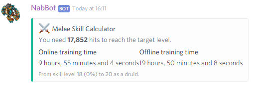
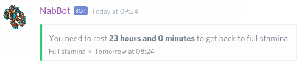
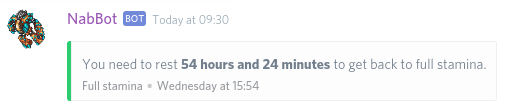
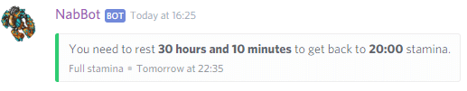
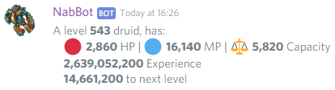
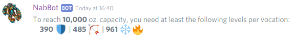

# Calculators commands
Commands to calculate various Tibia values.

!!! info
    Parameters are enclosed with `< >`.   
    Optional parameters are enclosed in brackets `[]`.
    
## blessings
**Usage:** `blessings <level>`  
**Other aliases:** `bless`

Calculates the price of blessings at a specific level.

For players over level 100, it will also display the cost of the Blessing of the Inquisition.

??? Summary "Examples"
    **/bless 90**  
      
    **/bless 140**  
    

----
## distanceskill
**Usage:** `distanceskill <current> <percentage> <target> <vocation> [loyalty]`  

Calculates the training time required to reach a target distance skill level.

For the moment, online and offline training calculation is unavailable.

??? Summary "Examples"
    **/distanceskill 56 3 70 rp 10**  
    

----
## magiclevel
**Usage:** `magiclevel <current> <percentage> <target> <vocation> [loyalty]`  

Calculates the training time required to reach a target magic level.

It shows the needed mana, offline training time and excercise weapons needed.

??? Summary "Examples"
    **/magiclevel 80 45 85 druid**  
      
    **/magiclevel 6 83 8 knight 15**  
    

----
## meleeskill
**Usage:** `meleeskill <current> <percentage> <target> <vocation> [loyalty]`  

Calculates the training time required to reach a target skill level.

It shows the needed hits, online training time and offline training time.  
For knights, it also shows exercise weapons needed.

This only applies to axe, club and sword fighting.

??? Summary "Examples"
    **/meleeskill 10 0 70 knight 50**  
      
    **/meleeskill 18 0 20 druid**  
    

## stamina
**Syntax:** `stamina <current stamina> [desired stamina]`

Tells you the time you have to wait to restore stamina.

To use it, you must provide your current stamina, in this format: `hh:mm`.
The bot will show the time needed to reach full stamina if you were to start sleeping now.

Optionally, you can provide the target stamina you want.

The footer text shows the time in your timezone where your stamina would be at the target stamina.

??? Summary "Examples"
    **/stamina 39:00**  
      
    **/stamina 28:32**  
      
    **/stamina 10:00 20:00**  
    

----

## stats
**Syntax:** `stats <level>,<vocation` or `stats <character>`

Calculates character stats based on vocation and level.

Shows hitpoints, mana, capacity, total experience and experience to next level.

This command can be used in two ways:

1. To calculate the stats for a certain level and vocation. (`stats <level>,<vocation>`)
2. To calculate the stats of a character. (`stats <character>`)

??? Summary "Examples"
    **/stats 543,elder druid**  
      
    **/stats Galarzaa Fidera**  
    

----

### stats capacity
**Syntax:** `/stats capacity <target capacity>`  
**Other aliases:** `stats cap`

Calculates the level required to reach the specified capacity.

The levels needed for each vocation are shown.

??? Summary "Example"
    **/stats capacity 10000**    
    

----

### stats hitpoints
**Syntax:** `/stats hitpoints <target hitpoints>`  
**Other aliases:** `stats hp`

Calculates the level required to reach the specified hitpoints.

The levels needed for each vocation are shown.

??? Summary "Example"
    **/stats hitpoints 3000**    
    

----

### stats mana
**Syntax:** `/stats mana <target mana>`  
**Other aliases:** `stats mp`

Calculates the level required to reach the specified mana.

The levels needed for each vocation are shown.

??? Summary "Example"
    **/stats mana 5000**    
      
