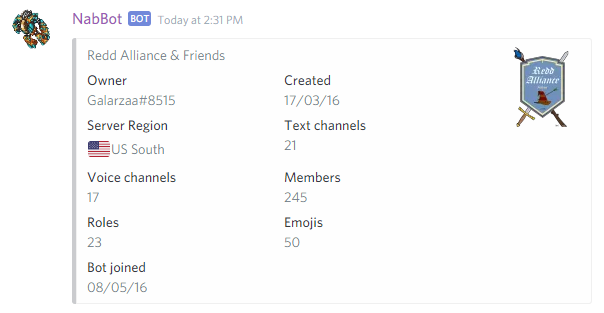
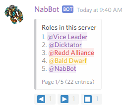
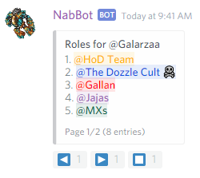
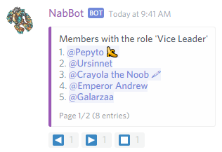

!!! note
    The information contained here refers to the `master` branch, it will be updated to `rewrite` documentation soon.

!!! info
    Words in italics are parameters.  
    Parameters enclosed in brackets `[]` are optional.

## /help
**Syntax:** /help *[command]*

Displays commands available to the user.

If a category (a.k.a Cog) is specified, it will show only commands in that category.  
If a command is specified, it will show more information about that commands, and commands if available.  
Further help can be obtained by calling help for subcommands.  

??? Summary "Examples"

    **/help**
      
    *(The reply is cropped, commands shown depend on caller)*
    
    **/help guild**  
    
    
    **/help guild info**  
    

----

## /choose
**Syntax:** /choose *option1 option2 ... optionN*

The bot randomly chooses one of the options given.
Options with spaces in them must be quoted or they will be considered as multiple options.

??? Summary "Examples"

    **/choose "Option A" optionb "Option C"**  
    

----

## /uptime

Shows the time the bot has been running.

??? Summary "Examples"

    **/uptime**  
    

----

## /about

Shows various information about the bot.

??? Summary "Examples"

    **/about**  
    

----    
    
## /server
**Other aliases:** /serverinfo, /server_info

Shows information about the current server.

??? Summary "Examples"

    **/server**  
    

----

## /roles
**Syntax:** /roles [*userName*]

Shows a list of roles in the server. If a user is specified, roles assigned to them will be shown instead.

??? Summary "Examples"
  
    **/roles**  
    
    
    **/roles Galarzaa**  
    

----

## /role
**Syntax:** /role *roleName*

Shows a list of members that have the specified role.

??? Summary "Examples"
  
    **/role Vice Leader**  
    

----

## /events

Shows a list of upcoming and recent events.

??? Summary "Examples"

    **/event**  
    
    

### /events info
**Syntax**: /events info *id*

Shows details about an event with a specific id. The id can be seen when using /events or after creating an event.

The time shown on the bottom is in the local timezone of the viewer.
  
??? Summary "Examples"

    **/event info 136**  
    
   

### /events add
**Syntax**: /events add *starttime* *name[,description]*

Creates an event. The start time must be set by specifying in how much time the event will start from now, e.g. 1d3h20m, 20h4m, 1d20m, 70m.  

A description for an event is optional. Description can contain links using the following syntax `[title](url)`

Once the event is created, the id of the event will be returned. This id is used to edits, subscribe or join events.
Events can only be edited by the creator or by bot admins.

Users can only have 2 active events simultaneously.

After using the command, the bot will ask for confirmation and show a preview of the event.
The start time displayed is based on the viewer's local time.

??? Summary "Example"

    **/event add 5h Inquisition Quest,Remember to bring holy water!**  
    **`[TibiaWiki link](http://tibia.wikia.com/wiki/Inquisition_quest)`**  
    

### /event delete
**Syntax**: /event *id*  
**Other aliases:** /event remove, /event cancel

Deletes or cancels an event.

??? Summary "Examples"

    **/event delete 136**  
    

### /event subscribe
**Syntax**: /event subscribe *id*  
**Other aliases:** /event sub

Lets you subscribe to an upcoming event. Meaning you will receive private messages when the event time is close.

??? Summary "Examples"

    **/event sub 136**  
    

### /event unsubscribe
**Syntax**: /event unsubscribe *id*
**Other aliases:** /event unsub

Unsubscribes you from an event.

??? Summary "Examples"

    **/event unsub 136**  
    
    
### /event join
**Syntax:** /event join *id* *char*

Lets you join the event with a character registered to you.
Events can be set to not joinable and only the creator can add characters.

??? Summary "Examples"

    **/event join 136 Galarzaa Fidera**  
    
    
### /event leave
**Syntax:** /event leave *id*

Lets you leave an event you had joined before.

??? Summary "Examples"

    **/event leave 136**  
    

### /event addplayer
**Syntax:** /event addplayer *id* *character*  
**Other aliases:** /event addchar

Adds someone else's character to the event. Only the event creator can do this.

This is useful for non joinable events, so the creator can control who's going or not.

The character must be registered to someone in the same server.

??? Summary "Examples"

    **/event addplayer 136 Nezune**  
    

### /event removeplayer
**Syntax:** /event removeplayer *id* *character*  
**Other aliases:** /event removechar

Removes someone from the event

??? Summary "Examples"

    **/event addplayer 136 Nezune**  
    

### /event edit
####/event edit name
**Syntax:** /event edit name *id* [*new_name*]

Edit's an event's name. If no new name is provided initially, the bot will ask for one.

####/event edit description
**Syntax:** /event edit description *id* [*new_description*]

Edit's an event's description. If no new description is provided initially, the bot will ask for one.

To remove an even't description, say `blank`.

####/event edit time
**Syntax:** /event edit time *id* [*new_time*]

Edit's an event's start time. If no new time is provided initially, the bot will ask for one.

####/event edit joinable 
**Syntax:** /event edit joinable *id* [*yes_no*]

Sets whether the event is joinable or not.  
If the event is joinable, anyone can use `/event join`.
Otherwise, the creator can add characters themselves by using `/event addchar`.

####/event edit slots
**Syntax:** /event edit slots *id* [*new_slots*]

Sets the number of characters an event can have. By default this is 0, which means no limit.

### /event make
Guides you step by step through the event making process.
