# General commands

!!! info
    Parameters are enclosed with `< >`.   
    Optional parameters are enclosed in brackets `[]`.

## about

Shows information about the bot.

??? Summary "Examples"

    **/about**  
    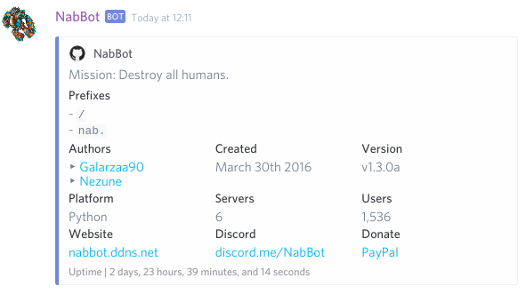

----

## choose
**Syntax:** `choose <choices..>`

Chooses between multiple choices.

Each choice is separated by spaces. For choices that contain spaces surround it with quotes.
e.g. "Choice A" ChoiceB "Choice C"

??? Summary "Examples"

    **/choose "Option A" optionb "Option C"**  
    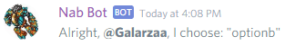

----

## help
**Syntax:** `help [command]`

Shows help about a command or the bot.
        
- If no command is specified, it will list all available commands
- If a command is specified, it will show further info, and its subcommands if applicable.
- If a category is specified, it will show only commands in that *categor*.

Various symbols are used to represent a command's signature and/or show further info.  
**&lt;argument&gt;**  
This means the argument is __**required**__.

**[argument]**  
This means the argument is __**optional**__.

**[A|B]**  
This means the it can be __**either A or B**__.

**[argument...]**  
This means you can have __**multiple arguments**__.

🔸  
This means the command has subcommands.
Check the command's help to see them. 

??? Summary "Examples"

    **/help**  
    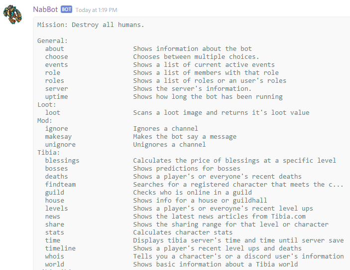
    
    **/help guild**  
    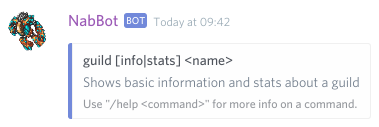
    
    **/help guild info**  
    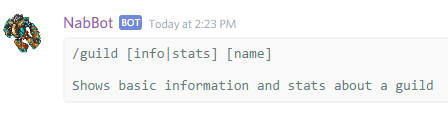

----

## events
**Other aliases:** `event` 

Shows a list of upcoming and recent events.

??? Summary "Examples"

    **/event**  
    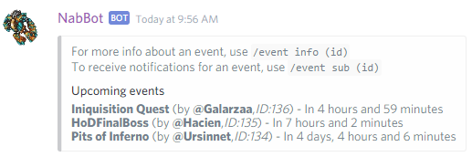

----
   
### events add
**Syntax**: `events add <starts in> <name>[,description]`

Creates a new event.

`starts in` is in how much time the event will start from the moment of creation.
This is done to avoid dealing with different timezones.
Just say in how many days/hours/minutes the event is starting.

The time can be set using units such as 'd' for days, 'h' for hours, 'm' for minutes and 'd' for seconds.
Examples: 1d20h5m, 1d30m, 1h40m, 40m

The event description is optional, you can also use links like: `[link title](link url)`.

Once the event is created, the id of the event will be returned. This is used for further edits.

??? Summary "Example"

    **/event add 5h Inquisition Quest,Remember to bring holy water!**  
    **`[TibiaWiki link](http://tibia.wikia.com/wiki/Inquisition_quest)`**  
    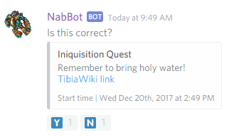

----

### event addplayer
**Syntax:** `event addplayer <id> <character>`  
**Other aliases:** `event addchar`

Adds a character to an event.

Only the creator can add characters to an event.
If the event is joinable, anyone can join an event using `event join`

??? Summary "Examples"

    **/event addplayer 136 Nezune**  
    

----

### event edit

Use the subcommands to edit the event's properties.
Only the creator of the event and mods can edit an event.
Past events can't be edited.

----

#### event edit description
**Syntax:** `event edit description <id> [new description]`  
**Other aliases:** `event edit desc`, `event edit details`

Edits an event's description.
        
If no new description is provided initially, the bot will ask for one.  
To remove the description, say `blank`.

----

#### event edit joinable 
**Syntax:** `event edit joinable <id> [yes/no]`  
**Other aliases:** `event edit open`

Changes whether anyone can join an event or only the owner may add people.

If an event is joinable, anyone can join using `event join`  .
Otherwise, the event creator has to add people with `event addplayer`.

----

#### event edit name
**Syntax:** `event edit name <id> [new name]`  
**Other aliases:** `event edit title`

Edit's an event's name.

If no new name is provided initially, the bot will ask for one.

----

#### event edit slots
**Syntax:** `event edit slots <id> [new slots]`  
**Other aliases:** `event edit size`

Edits an event's number of slots

Slots is the number of characters an event can have. By default this is 0, which means no limit.

----

#### event edit time
**Syntax:** `event edit time <id> [new start time]`

Edit's an event's start time.

If no new time is provided initially, the bot will ask for one.

----

### events info
**Syntax**: `events info <id>`

Displays an event's info.

The start time shown in the footer is always displayed in your device's timezone.
  
??? Summary "Examples"

    **/event info 136**  
    

----
    
### event join
**Syntax:** `event join <id> <char>`

Join an event with a specific character

You can only join an event with a character at a time.  
Some events may not be joinable and require the creator to add characters themselves.

??? Summary "Examples"

    **/event join 136 Galarzaa Fidera**  
    

----
    
### event leave
**Syntax:** `event leave <id>`

Leave an event you were participating in.

??? Summary "Examples"

    **/event leave 136**  
    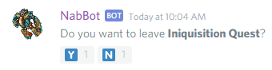

----

### event make

Creates an event guiding you step by step

Instead of using confusing parameters, commas and spaces, this commands has the bot ask you step by step.

----

### event participants
**Syntax:** `event participants <id>`

Shows the list of characters participating in this event.

??? Summary "Examples"

    **/event participants 190**  
    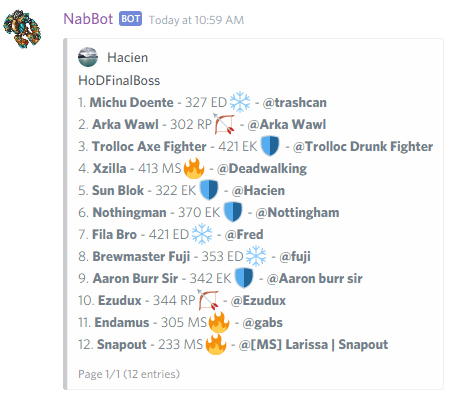

----

### event remove
**Syntax**: `event <id>`  
**Other aliases:** `event delete`, `event cancel`

Deletes or cancels an event.

??? Summary "Examples"

    **/event delete 136**  
    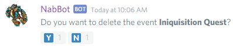

----

### event removeplayer
**Syntax:** `event removeplayer <id> <character>`  
**Other aliases:** `event removechar`

Removes a player from an event.

Players can remove themselves using `event leave`

??? Summary "Examples"

    **/event addplayer 136 Nezune**  
    

----

### event subscribe
**Syntax**: `event subscribe <id>`  
**Other aliases:** `event sub`

Subscribe to receive a PM when an event is happening.

??? Summary "Examples"

    **/event sub 136**  
    
    
----

### event unsubscribe
**Syntax**: `event unsubscribe id`  
**Other aliases:** `event unsub`

Unsubscribes you from an event.

??? Summary "Examples"

    **/event unsub 136**  
    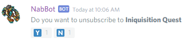

----

## quote
**Syntax:** `quote <message id>`

Shows a messages by its ID.

In order to get a message's id, you need to enable Developer Mode.  
Developer mode is found in `User Settings > Appearance`.  
Once enabled, you can right click a message and select **Copy ID**.

Note that the bot won't attempt to search in channels you can't read.

??? Summary "Examples"

    **/quote 343259808889044992**  
    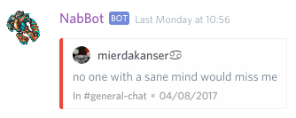

----
    
## serverinfo

Shows the server's information.

??? Summary "Examples"

    **/serverinfo**  
    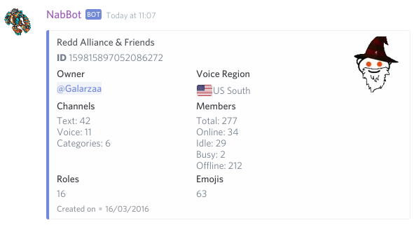

----

## uptime

Shows how long the bot has been running.

??? Summary "Examples"

    **/uptime**  
    
