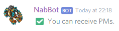
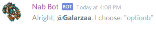
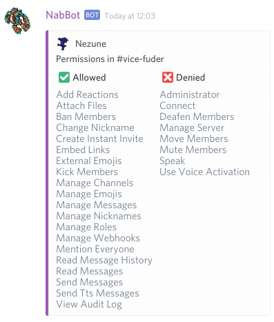
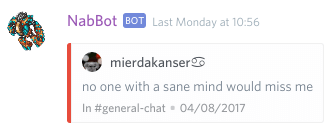

# General commands
General use commands.

!!! info
    Parameters are enclosed with `< >`.   
    Optional parameters are enclosed in brackets `[]`.
    
## checkpm
**Other aliases:** `checkdm`

Checks if you can receive PMs from the bot.

If you can't receive PMs, 'Allow direct messages from server members.' must be enabled in the Privacy Settings
 of any server where NabBot is in.
 
??? Summary "Examples"
    **/checkpm**  
    

----

## choose
**Syntax:** `choose <choices..>`

Chooses between multiple choices.

Each choice is separated by spaces. For choices that contain spaces surround it with quotes.
e.g. "Choice A" ChoiceB "Choice C"

??? Summary "Examples"
    **/choose "Option A" optionb "Option C"**  
    

----

## permissions
**Syntax:** `permissions [member] [channel]`

Shows a member's permissions in the current channel.

If no member is provided, it will show your permissions.  
Optionally, a channel can be provided as the second parameter, to check permissions in said channel.

??? Summary "Examples"
    **/permissions Nezune**  
    

----

## quote
**Syntax:** `quote <message id>`

Shows a messages by its ID.

In order to get a message's id, you need to enable Developer Mode.  
Developer mode is found in `User Settings > Appearance`.  
Once enabled, you can right click a message and select **Copy ID**.

Note that the bot won't attempt to search in channels you can't read.

??? Summary "Examples"
    **/quote 343259808889044992**  
    

----
    
## roll
**Syntax:** `roll [times][d[sides]]`

Rolls a die.

By default, it rolls a 6-sided die once.
You can specify how many times you want the die to be rolled.

You can also specify the number of sides of the die, using the format `TdS` where T is times and S is sides.

??? Summary "Examples"
    **/roll**  
      
    **/roll 10**  
      
    **/roll 7d20**  
        

----   
 