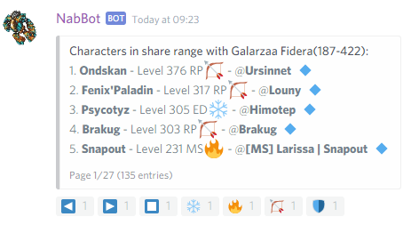

!!! note
    The information contained here refers to the `master` branch, it will be updated to `rewrite` documentation soon.

One of the main features of discord bots is being able to respond to commands.
All commands require a prefix in order to be recognized and to avoid command triggering accidentally.

By default, the command prefix is `/`, this can be changed in the main file by changing `command_prefix`.

Commands can be used on any channel where the bot can read and write.
Some commands may require extra permissions such as `Embed Links` or `Attach Files`, or might not be allowed in private messages.
Some commands can show longer responses if used in `ask-channel` (by default, #ask-nabbot).

For descriptions of each command check the different commands sections in the sidebar.

## Paginator

Some commands responses feature a *paginator* ([based on Rapptz' paginator class](https://github.com/Rapptz/RoboDanny/blob/master/cogs/utils/paginator.py)).
These can be easily spotted by the reactions automatically added to the reply (◀️▶️⏹️).
These reactions act as buttons, letting you scroll through the results.

When you click on one of the arrow reactions, the page is scrolled in that direction and your reaction is removed so you can use it again.
Using the stop reaction removes the paginating interface. 
Only the user that used the command can turn the pages.

!!! Note
    When used in private messages, the bot has no way of removing your reactions, so you must remove them and add them yourself again.
    
## Vocation Filter

Some commands, allow you to filter their character list by vocation. Allowing you to easily find a certain vocation.  
Similar to Paginator, they have reaction buttons to switch pages (◀️▶️⏹️).
Additionally, they may have up to 4 vocation emojis to filter:

* 🔥 - Filter sorcerers
* 🛡️ - Filter knights
* 🏹 - Filter paladins
* ❄️ - Filter druids

When a vocation is filtered, the list is updated to only show those. Clicking another vocation filter will now show only
that vocation. Clicking the current filtered vocation again will show all vocations again.

