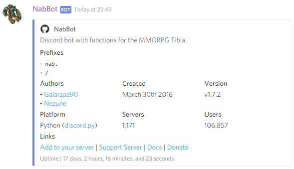
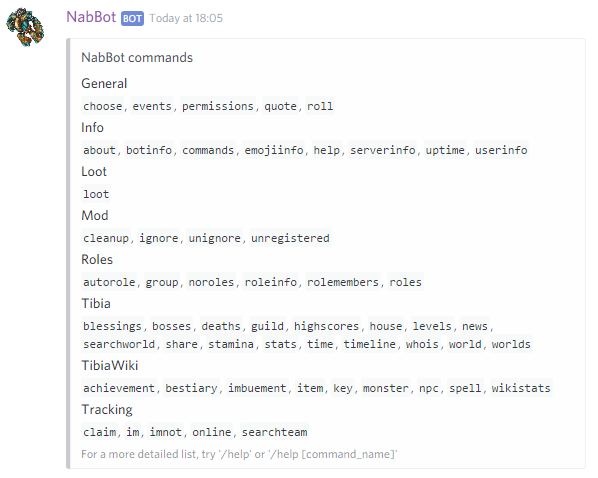
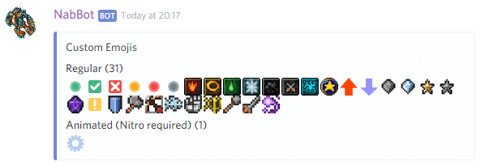
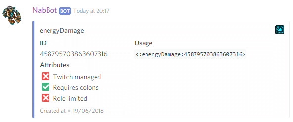
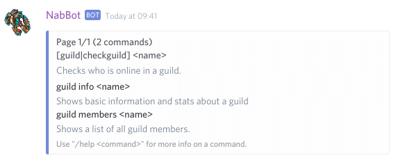
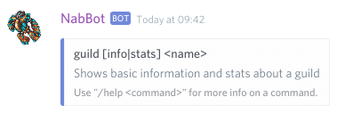
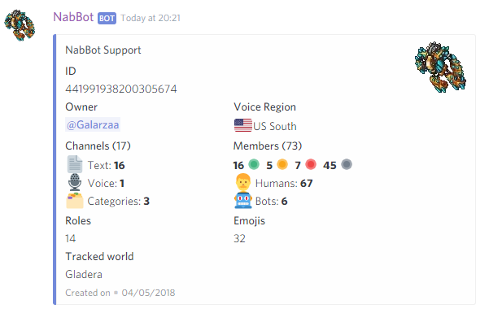
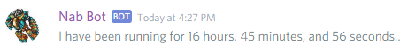
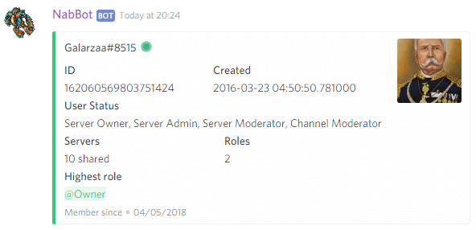

# Info commands

!!! info
    Parameters are enclosed with `< >`.   
    Optional parameters are enclosed in brackets `[]`.
    
## about
Shows basic information about the bot.

??? Summary "Examples"
    **/about**  
    

----

## botinfo
Shows advanced information about the bot.

??? Summary "Examples"
    **/botinfo**  
    

---

## commands
**Other aliases:** `commandlist`

Shows a simple list of all commands.
This displays all the commands you can use, with no description or subcommand information.    
Note that different commands might show up in server channels and in private messages.

For more details, use `help`.

??? Summary "Examples"
    **/commands**  
    

---

## channelinfo
**Syntax:** `channelinfo [channel]`

Shows information about a channel.

If no channel is specified, the information for the current channel is shown.

??? Summary "Examples"
    **/channelinfo**  
    

---

## emojiinfo
**Syntax:** `help [emoji]`

Shows information about an emoji, or shows all emojis.

If the command is sued with no arguments, all the server emojis are shown.

If an emoji, its ID or name is provided, it will show more information about it.

Only emojis in the current servers can be checked.

??? Summary "Examples"
    **/emojiinfo**  
      
    **/emojiinfo :energyDamage:**  
    

---

## help
**Syntax:** `help [command]`

Shows help about a command or the bot.
        
- If no command is specified, it will list all available commands
- If a command is specified, it will show further info, and its subcommands if applicable.
- If a category is specified, it will show only commands in that *categor*.

Various symbols are used to represent a command's signature and/or show further info.  
**&lt;argument&gt;**  
This means the argument is __**required**__.

**[argument]**  
This means the argument is __**optional**__.

**[A|B]**  
This means the it can be __**either A or B**__.

**[argument...]**  
This means you can have __**multiple arguments**__.

🔸  
This means the command has subcommands.
Check the command's help to see them. 

??? Summary "Examples"
    **/help**  
      
    **/help guild**  
      
    **/help guild info**  
    

----

## serverinfo
**Syntax:** `sererinfo [server]`

Shows the server's information.

The bot owner can additionally check the information of a specific server where the bot is.

??? Summary "Examples"
    **/serverinfo**  
    

----

## uptime

Shows how long the bot has been running.

??? Summary "Examples"
    **/uptime**  
    

---

## userinfo
**Syntax:** `userinfo [user]`  
**Other aliases:** `memberinfo`

Shows a user's information.

If no user is provided, it shows your own information.

About user statuses:

- Server Owner: Owner of the server
- Server Admin: User with `Administrator` permission
- Server Moderator: User with `Manage Server` permissions.
- Channel Moderator: User with `Manage Channels` permissions in at least one channel.

??? Summary "Examples"
    **/userinfo**  
    