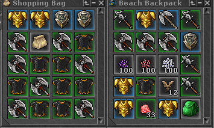
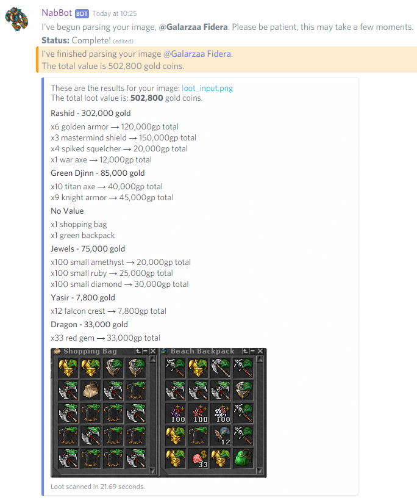
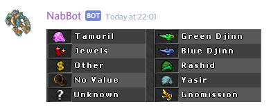

# Loot commands

!!! info
    Parameters are enclosed with `< >`.   
    Optional parameters are enclosed in brackets `[]`.

## loot

Scans an image of a container looking for Tibia items and shows an approximate loot value.

An image must be attached with the message. The prices used are NPC prices only.

The image requires the following:

- Must be a screenshot of inventory windows (backpacks, depots, etc).
- Have the original size, the image can't be scaled up or down, however it can be cropped.
- The image must show the complete slot.
- JPG images are usually not recognized.
- PNG images with low compression settings take longer to be scanned or aren't detected at all.

The bot shows the total loot value and a list of the items detected, separated into the NPC that buy them.

??? Summary "Example"
    **/loot** (attached image)  
      
      

----

### loot legend

Shows the meaning of the overlayed icons.

??? Summary "Example"
    **/loot legend**   
    

----