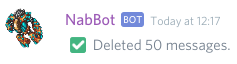
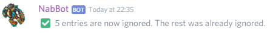
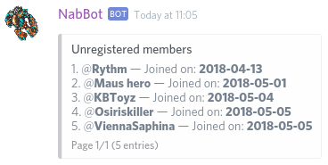

# Mod commands

Commands server moderators.

!!! info
    Parameters are enclosed with `< >`.   
    Optional parameters are enclosed in brackets `[]`.
    
## cleanup
**Syntax:** `cleanup [limit=50]`

Cleans the channel from bot commands.

If the bot has `Manage Messages` permission, it will also delete command invocation messages.

??? summary "Examples"
    **/cleanup**  
    

----

## ignore
**Syntax:** `ignore [entries...]`

Makes the bot ignore a channel or user.

Commands cannot be used in ignored channels or by ignored users.

The command accepts a list of names, ids or mentions of users or channels.  
If the command is used with no parameters, it ignores the current channel.

Ignores are bypassed by users with the `Manage Server` permission.

??? Summary "Example"
    **/ignore #support #chat #feedback-and-reports #message-suggestions #levels-and-deaths Tschis**  
    

----

### ignore list
Shows a list of ignored channels and users.

??? Summary "Example"
    **/ignore list**  
    

----

## makesay
**Syntax:** `makesay <message>`

Makes the bot say a message.
 
If it's used directly on a text channel, the bot will delete the command's message and repeat it itself.  
Note that deleting the message requires `Manage Messages` permissions in the channel.

If it's used on a private message, the bot will ask on which channel he should say the message.  
Each channel in the list is numerated, by choosing a number, the message will be sent in the chosen channel.

----

## unignore
**Syntax:** `unignore [channel]`

Removes a channel or user from the ignored list.

If no parameter is provided, the current channel will be unignored.

If the command is used with no parameters, it unignores the current channel.

----

## unregistered
Shows a list of users with no registered characters.

??? Summary "Example"
    **/unregistered**  
    

----
