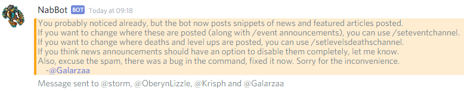
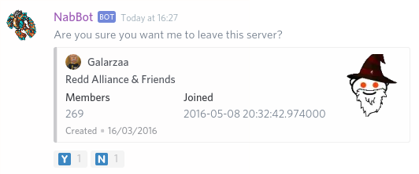
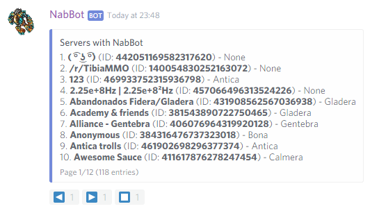
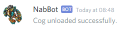
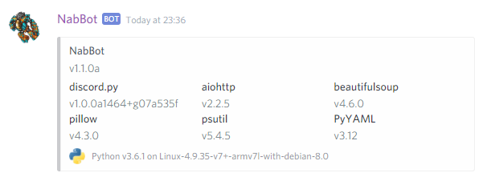

# Owner commands

All commands can only be run by users in the `owner_ids` list or the bot's application owner.
!!! info
    Parameters are enclosed with `< >`.   
    Optional parameters are enclosed in brackets `[]`.

## adminsmessage
**Syntax:** `adminsmessage [message]`  
**Other aliases:** `notifyadmins`

Sends a private message to all server owners.

Notifies all the owners of the servers where the bot is in.  
If no message is specified at first, the bot will ask for a message to send.

The message contains a signature to indicate who wrote the message.

??? Summary "Example"
    **/adminsmessage**  
      
    **After typing the message.**  
    

----

## eval
**Syntax:** `eval <code>`

Evaluates Python code.

This commands lets you evaluate python code. If no errors are returned, the bot will react to the command call.  
To show the result, you have to use `#!py print()`.  
Asynchronous functions must be waited for using `#!py await`.  
To show the results of the last command, use `#!py print(_)`.  

!!! Warning
    This command is meant for advanced users and debugging code. Use under your own risk.

??? Summary "Example"
    **/eval `#!py print(bot.get_member(162060569803751424))`**  
    

----

## leave
**Syntax:** `leave <server>`

Makes the bot leave a server.

The bot will ask for confirmation before leaving the server.

Once the bot has left a server, only a server administrator can add it back.

??? Summary "Example"
    **/leave 159815897052086272**  
    

----

## load
**Syntax:** `load <cog>`

Loads a cog.

If there's an error while compiling, it will be displayed here.  
Any cog can be loaded here, including cogs made by user.

When loading and unloading cogs in subdirectories, periods (`.`) are used instead of slashes (`/`).
For example, a cog found in `cogs/tibia.py` would be loaded as `cogs.tibia`.

??? Summary "Example"
    **/load cogs.tibia**  
    

----

## merge
**Syntax:** `merge <old world> <new world>`

Renames all references of an old world to a new one.

This command should updates all the database entries, changing all references of the old world to the new one

This updates all characters' worlds and discord guild's tracked worlds to the new world.
All the highscores entries of the old world will be deleted.

This should be done immediately after the world merge occurs and not before, or else tracking will stop.

Use this with caution as the damage can be irreversible.

Example: `merge Fidera Gladera`

??? Summary "Example"
    **/merge Fidera Gladera**  
    

----

## namelock
**Syntax:** `namelock <old name>,<new name>`   
**Other aliases:** `rename`, `namechange`

Register the name of a new character that was namelocked.

Characters that get namelocked can't be searched by their old name, so they must be reassigned manually.

If the character got a name change (from the store), searching the old name redirects to the new name, so
these are usually reassigned automatically.

In order for the command to work, the following conditions must be met:

- The old name must exist in NabBot's characters database.
- The old name must not be a valid character in Tibia.com
- The new name must be a valid character in Tibia.com
- They must have the same vocation, not considering promotions.

----

## ping
Show's the bot's response times.

??? Summary "Example"
    **/ping**  
    

----

## repl
Starts a REPL session in the current channel.

Similar to `/debug`, except this keep an open session where variables are stored.  
To exit, type ``exit()``.

!!! Warning
    This command is meant for advanced users and debugging code.

----

## shutdown
Shutdowns the bot.

----

## servers
Shows a list of servers the bot is in.

??? Summary "Example"
    **/servers**  
    

----

## sql
**Syntax:** `sql <query>`

Executes a SQL query and shows the results.

If the results are too long to display, a text file is generated and uploaded.

??? Summary "Example"
    **/sql SELECT * FROM chars WHERE user_id = 162060569803751424**  
    

----

## unload
**Syntax:** `unload <cog>`

Unloads a cog.

!!! Note
    Unloading `cogs.owner` would remove the `/load` command, making it impossible to reload cogs until restarting the bot.

??? Summary "Example"
    **/unload cogs.tibia**  
    

----

## versions
Shows NabBot's version and the versions of all dependencies.

This command can be useful to find out why the bot is not behaving as it should or for submitting bug reports.

Currently, discord.py's version can't be controlled because an unreleased version is being used.
This will change once `v1.0.0` is ~~finally~~ released.

For every dependency, an emoji indicates if the requirement is met:

- ✅ Indicates that the installed version is in the required range.
- ❌ Indicates that the installed version is under the required range. This means some features may not be available.
- ❗ Indicates that the installed version is higher than the required range.
  This is usually not as bad as the previous case, but there may be some incompatibility issues.

??? Summary "Example"
    **/versions**  
    