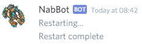
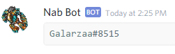

All commands can only be run by users in the `owner_ids` list or the bot's application owner.

!!! info
    Words in italics are parameters.  
    Parameters enclosed in brackets `[]` are optional.

## /restart
**Other aliases:** /reset

Completely restarts the bot, reloading all code. When used, the bot shutsdown and then restarts itself in 5 seconds.

Once the bot starts again, it will notify the user that restarted it.

??? Summary "Example"

    **/restart**  
    

----

## /unload
**Syntax**: /unload *name*

Unloads a cog. Cogs are extensions that contain their own commands and tasks.

!!! Note
    Unloading `cogs.owner` would remove the `/load` command, making it impossible to reload cogs until restarting the bot.

??? Summary "Example"

    **/unload cogs.tibia**  
    

----

## /load

Loads a cog. If there's an error while compiling, it will be displayed here.
Any cog can be loaded here, including cogs made by user.

When loading and unloading cogs in subdirectories, periods (`.`) are used instead of slashes (`/`).
For example, a cog found in `cogs/tibia.py` would be loaded as `cogs.tibia`.

    **/load cogs.tibia**  
    

----

## /debug
**Syntax:** /debug *code*

Evaluates Python code. This command can be used to run python command and get the response as a reply.

!!! Warning
    This command is meant for advanced users and debugging code.

??? Summary "Example"

    **/debug bot.get_member(162060569803751424)**  
    

----

## /repl

Starts a REPL session in the current channel.
Similar to `/debug`, except this keep an open session where variables are stored.

To exit, type ``exit()``.

!!! Warning
    This command is meant for advanced users and debugging code.

----

## /servers

Shows a list of servers where the bot is in, along with their owners and tracked world.

??? Summary "Example"

    **/debug bot.get_member(162060569803751424)**  
    

----

## /admins_message
**Syntax**: /admins_message [*message*]  
**Other aliases:** /message_admins, /adminsmessage, /msgadmins, /adminsmsg

Sends a private message to all the server owners of the servers the bot is.
If no message is specified at first, the command will prompt the user to enter a message to send.

Messages contain a signature to indicate who wrote the message.
    
??? Summary "Example"

    **/admins_message**  
    
    
    **After typing the message.**  
    
