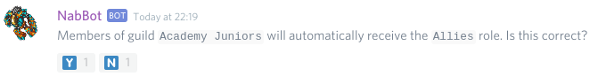
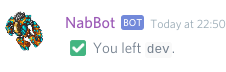
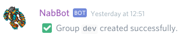
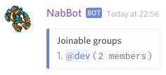
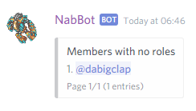

# Roles commands
Commands related to role management.

!!! info
    Parameters are enclosed with `< >`.   
    Optional parameters are enclosed in brackets `[]`.

## autorole
Autorole commands.
        
All the subcommands require having `Manage Roles` permission.

----

### autorole add
**Syntax:** `autorole add <role> <guild>`

Creates a new autorole rule.

Rules consist of a role and a guild name.  
When a user has a registered character in said guild, they receive the role.  
If they stop having a character in the guild, the role is removed.

If `*` is used as a guild. It means that the role will be given for having any assigned character.

Role names, role mentions or role ids are allowed. Role names with multiple words must be quoted.  
Note that current members will be updated until their characters or guilds change.

??? Summary "Examples"
    **/autorole add Allies Academy Junior**  
      
    **/autorole add Identified ***  
    

----

### autorole refresh

Triggers a refresh on all members.

This will apply existing rules to all members.
Note that guild changes from members that haven't been online won't be detected.
Deleted rules won't have any effect.

This command can only be used once per server every hour.

----

### autorole list
**Other aliases:** `autorole rules`

Shows a list of autorole rules.

??? Summary "Examples"
    **/autorole list**  
    

----

### autorole remove
**Syntax:** `autorole remove <role> <guild>`  
**Other aliases:** `autorole delete`

Removes an autorole rule.

Role names, mentions and ids are accepted. Role names with multiple words need to be quoted.

Note that members that currently have the role won't be affected.

??? Summary "Examples"
    **/autorole remove "Redd Alliance" Redd Alliance**  
    

----

## group
**Syntax:** `group <name>`

Joins or leaves a group (role).

If you're not in the group, you will be added.
If you're already in the group, you will be removed.

To see a list of joinable groups, use `group list`

??? Summary "Examples"
    **/group dev**  
      
    **/group dev**  
    

----

### group add
**Syntax:** `group add <name>`

Creates a new group for members to join.

The group can be a new role that will be created with this command.  
If the name matches an existent role, that role will become joinable.

You need `Manage Roles` permissions to use this command.

??? Summary "Examples"
    **/group add dev**  
      

----

### group list

Shows a list of available groups.

??? Summary "Examples"
    **/group list**  
    

----

### group remove
**Syntax:** `group remove <group>`  
**Other aliases:** `group delete`

Removes a group.

Removes a group, making members unable to join.
When removing a group, you can optionally delete the role too.

## noroles
**Other aliases:** `norole`

Shows a list of members that have no roles.

??? Summary "Examples"
    **/noroles**  
    

----

## roleinfo
**Syntax:** `roleinfo <role>`

Shows details about a role.

??? Summary "Examples"
    **/roleinfo Redd Alliance**
    

----

## rolemembers
**Syntax:** `rolemembers <role>`

Shows a list of members with that role.

??? Summary "Examples"
    **/rolemembers Vice Leader**  
    

----

## roles
**Syntax:** `roles [user]`

Shows a user's roles or a list of server roles.

If a user is specified, it will list their roles.
If user is blank, I will list all the server's roles.

??? Summary "Examples"
    **/roles**  
      
    **/roles Galarzaa**  
    

----