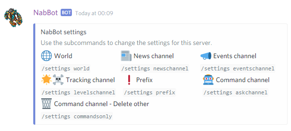

# Settings command
Commands related to server customization.

!!! info
    Parameters are enclosed with `< >`.   
    Optional parameters are enclosed in brackets `[]`.
    
## settings
Shows the available server-specific settings that can be modified.

??? Summary "Examples"
    **/settings**  
    
    
----

### settings askchannel
**Syntax:** `settings askchannel [channel]`  
**Other aliases:** `settings commandchannel`

Changes the channel where longer replies for commands are given.

In this channel, pagination commands show more entries at once and command replies in general are longer.

----

### settings commandsonly
**Syntax:** `settings commandsonly [yes/no]`

Sets whether only commands are allowed in the command channel.

If this is enabled, everything that is not a message will be deleted from the command channel.
This allows the channel to be used exclusively for commands.

If the channel is shared with other command bots, this should be off.

Note that the bot needs `Manage Messages` permission to delete messages.

----

### settings eventschannel
**Syntax:** `settings eventschannel [channel]`

Changes the channel where upcoming events are announced.

This is where announcements of events about to happen will be made.
By default, the highest channel on the list where the bot can send messages will be used.
If the assigned channel is deleted or forbidden, the top channel will be used again.

If this is disabled, users that subscribed to the event will still receive notifications via PM.

----

### settings levelschannel
**Syntax:** `settings levelschannel [channel]`  
**Other aliases:** `settings deathschannel`, `settings trackingchannel`

Changes the channel where levelup and deaths are announced.

This is were all level ups and deaths of registered characters will be announced.
By default, the highest channel on the list where the bot can send messages will be used.
If the assigned channel is deleted or forbidden, the top channel will be used again.

If this is disabled, Announcements won't be made, but there will still be tracking.

----

### settings newschannel
**Syntax:** `settings newschannel [channel]`

Changes the channel where Tibia news are announced.

This is where all news and articles posted in Tibia.com will be announced..
By default, the highest channel on the list where the bot can send messages will be used.
If the assigned channel is deleted or forbidden, the top channel will be used again.

----

### settings prefix
**Syntax:** `settings prefix [prefix]`  

Changes the command prefix for this server.

The prefix are the characters that go before a command's name, in order for the bot to recognize the command.
A maximum of 5 commands can be set per server.

To remove an existing prefix, use it as a parameter.

If you want to have a space at the end, such as: `nabbot help`, you have to use double quotes "nabbot ".
Multiple words also require using quotes.

Mentioning the bot is always a valid command and can't be changed."

----

### settings world
**Syntax:** `settings world [world]`  

Changes the world this discord server tracks.

The tracked world is the Tibia world that this discord server is following.
Only characters in that world will be registered.

----