# Tibia commands

Commands related to Tibia, gathered from information present in Tibia.com

!!! info
    Parameters are enclosed with `< >`.   
    Optional parameters are enclosed in brackets `[]`.

## deaths
**Syntax:** `deaths [player]`  
**Other aliases:** `deathlist`

Shows a character's recent deaths.

If this discord server is tracking a tibia world, it will also show previous registered deaths.

Additionally, if no name is provided, relevant recent deaths will be shown.

??? Summary "Examples"
    **/deaths Xzilla** (Character's owner is visible to command user)  
    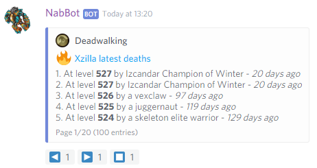  
    **/deaths**  
    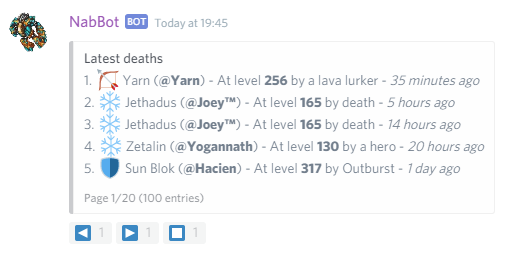  
    **/deaths Robinsaurus Rex** (Character not registered or owner not visible)  
    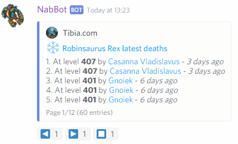

----

### deaths monster
**Syntax:** `deaths monster <name>`  
**Other aliases:** `deaths mob`, `deaths killer`

Shows the latest deaths caused by a specific monster.

??? Summary "Example"
    **/deaths mob Lloyd**  
    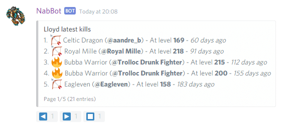

----

### deaths user
**Syntax:** `death user <name>`

Shows recent deaths by all characters registered to a user.

??? Summary "Example"
    **/deaths user Nezune**  
    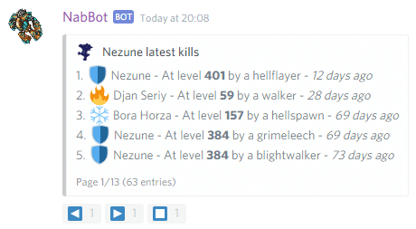

----

### deaths stats
**Syntax:** `death stats [week/month]`

Shows death statistics.

Shows the total number of deaths, the characters and users with more deaths, and the most common killers.

To see a shorter period, use `week` or `month` as a parameter.

??? Summary "Example"
    **/deaths stats**  
    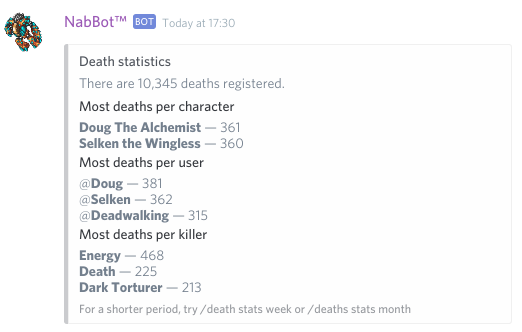

----

## guild
**Syntax:** `guild <name>`  
**Other aliases:** `checkguild`

Show's the number of members the guild has and a list of their users.
It also shows whether the guild has a guildhall or not, and their funding date.

??? summary "Examples"
    **/guild Redd Alliance**  
    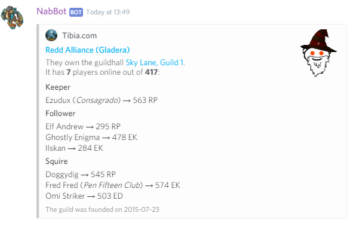

----

### guild info
**Syntax:** `guild info <name>`  
**Other aliases:** `guild stats`

Shows basic information and stats about a guild.
        
It shows their description, homepage, guildhall, number of members and more.

??? summary "Examples"
    **/guild info Bald Dwarfs**  
    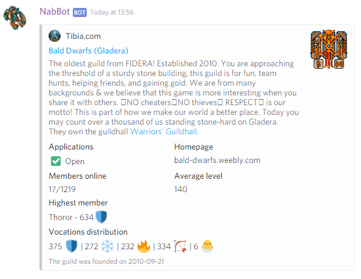

----

### guild members
**Syntax:** `guild members <name>`  
**Other aliases:** `guild list`

Shows a list of all guild members.

Online members have an icon next to their name.

??? summary "Examples"
    **/guild members Redd Alliance**  
    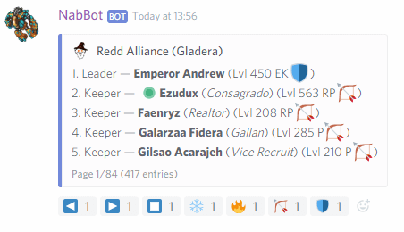

----

## highscores
**Syntax**: `highscores [world,][category][,vocation]`

Shows the entries in the highscores.

If the server is already tracking a world, the tracked world will be used if no world is specified.

Available categories are: experience, magic, shielding, distance, sword, club, axe, fist, fishing,
achievements and loyalty.  
Available vocations are: all, paladin, druid, sorcerer, knight.

??? summary "Examples"
    **/highscores**  
    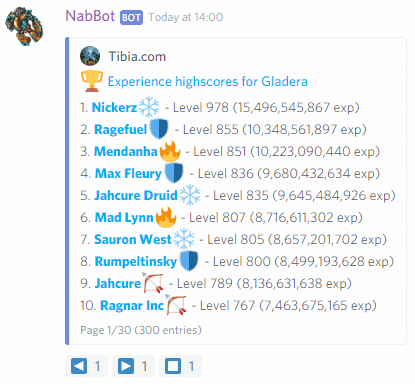  
    **/highscores shielding**  
      
    **/highscores antica,magic,paladin**  
    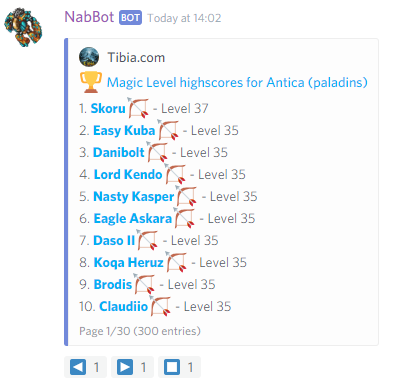

----

### highscores global
**Syntax**: `highscores global [category]`

Shows the combined highscores of all worlds.

Ties are grouped under the same rank and ordered alphabetically.

Only the following categories are available: experience, sword, axe, club, distance, shielding, fist, fishing,
magic, magic_knights, magic_paladins, loyalty, achievements.

??? summary "Examples"
    **/highscores global**  
    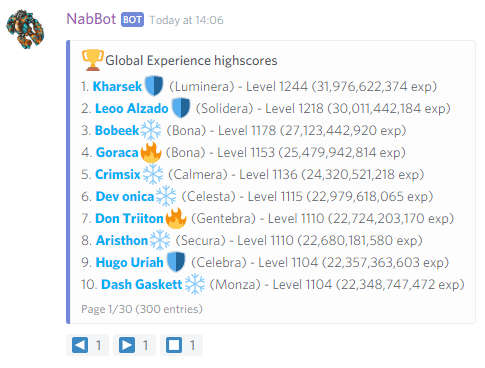  
    **/highscores global magic**  
    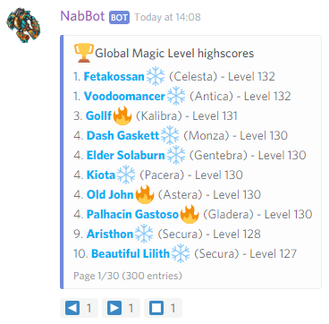  

----

## house
**Syntax:** `house <name>[,world]`  
**Other aliases:** `guildhall`

Shows info for a house or guildhall.

By default, it shows the current status of a house for the current tracked world (if any).
If used on private messages, no world is looked up unless specified.

To specify a world, add the world at the end separated with a comma.

??? Summary "Examples"
    **/house darashia 8, flat 03**  
    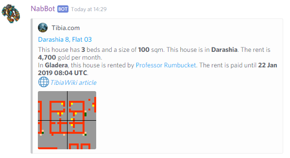  
    **/house caveman shelter,calmera**  
    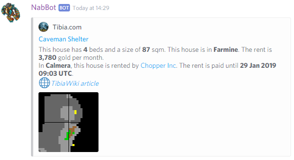
    **/house the tibianic** (On PM or server not tracking world)  
    

----

## levels
**Syntax:** `levels [player]`  
**Other aliases:** `levelups`

Shows a character's or everyone's recent level ups.
       
If a character is specified, it displays a list of its recent level ups.
If no character is specified, it will show the recent level ups of all registered characters in the server.

This only works for characters registered in the bots database, which are the characters owned
by the users of this discord server.

??? Summary "Examples"
    **/levels**  
      
    **/levels Dre amz**  
    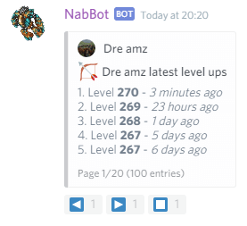

----

### levels user
**Syntax:** `levels user <name>`  

Shows a user's recent level ups on their registered characters.

??? Summary "Examples"
    **/levels user Nezune**  
    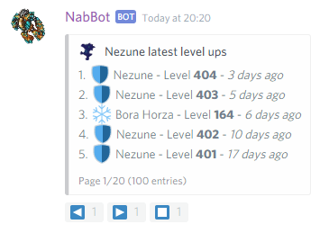

----

## news
**Syntax:** `news [id]`

Shows the latest news articles from Tibia.com.

If no id is supplied, a list of recent articles is shown, otherwise, a snippet of the article is shown.

??? Summary "Examples"
    **/news**    
    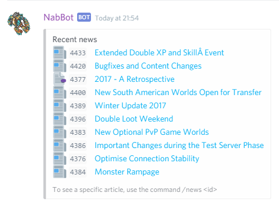  
    **/news 4400**  
    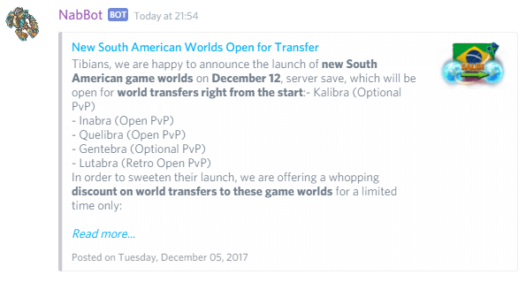

----

### news ticker
**Other aliases:** `news newsticker`

Shows the latest news tickers from Tibia.com.

??? Summary "Examples"
    **/news ticker**    
    

----

## searchworld
**Syntax:** `searchworld <name>[,world]` or `searchworld <level>[,world]` or `searchworld <min>,<max>[,world]`  
**Other aliases:** `whereworld`, `findworld`

Searches for online characters that meet the criteria.

There are 3 ways to use this command:

- Find a character in share range with another character. (`searchworld <name>`)
- Find a character in share range with a certain level. (`searchworld <level>`)
- Find a character in a level range. (`searchworld <min>,<max>`)

By default, the tracked world is searched, unless specified at the end of the parameters

You can add the world where you want to look in by adding a comma, followed by the name of the world.  
Example: `searchworld Cachero,Calmera`

??? Summary "Examples"
    **/searchworld Galarzaa Fidera**  
    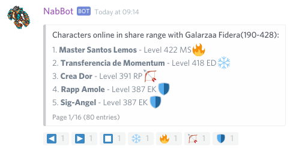  
    **/searchworld Nezune,Calmera**  
    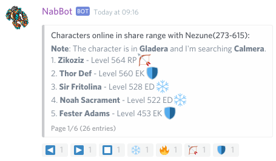  
    **/searchworld 600,700**  
    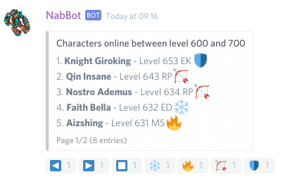  
    **/searchworld 70**  
    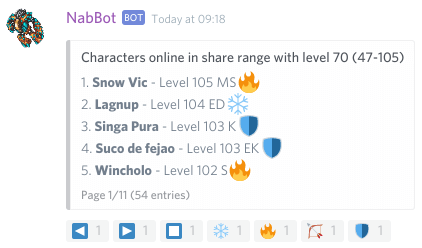

----

## share
**Syntax:** `share <level>` or `share <character>` or `share <char1, char2, ...>`  
**Other aliases:** `expshare`, `party`

Shows the sharing range for that level or character or list of characters.

This command can be used in three ways:

1. Find the share range of a certain level. (`share <level>`)
2. Find the share range of a character. (`share <name>`)
3. Find the joint share range of a group of characters. (`share <name1, name2...>`)

??? summary "Examples"
    **/share 300**  
    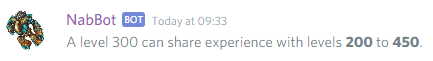  
    **/share Galarzaa Fidera**  
    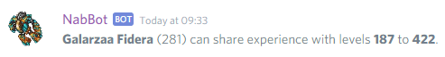  
    **/share Galarzaa Fidera, Nezune, Xzilla**  
    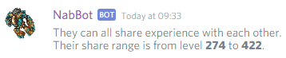  
    **/share Galarzaa Fidera, Topheroo**  
    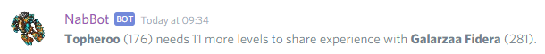

----

## timeline
**Syntax:** `timeline [character]`  
**Other aliases:** `story`

Shows a character's recent level ups and deaths. :flame: :fire:

If no character is provided, the timeline of all registered characters in the server will be shown.

Characters must be registered in order to see their timelines.

- 🌟 Indicates level ups
- 💀 Indicates deaths

??? Summary "Examples"
    **/timeline**  
      
    **/timeline Fila Bro**  
    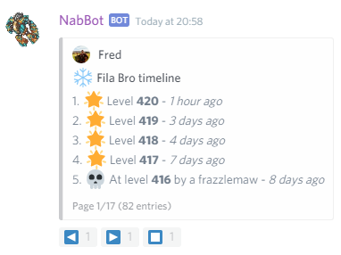

----

### timeline user
**Syntax:** `timeline user <name>`

Shows a users's recent level ups and deaths on their characters.

??? Summary "Examples"
    **/timeline user Pepyto 🍌**  
    

----

## time
**Other aliases:** `serversave`

Displays Tibia server's time and time until server save.

Server moderators can manage displayed timezones using the subcommands.

??? Summary "Examples" 
    **/time**  
    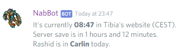

----

### time add
**Syntax:** `time add <timezone>`

Adds a new timezone to display.

You can look by city, country or region.  
Once the timezone is found, you can set the name you want to show on the `time` command.

Only Server Moderators can use this command.

??? Summary "Examples" 
    **/time add berlin**  
    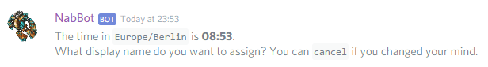

----

### time list
Shows a list of all the currently added timezones.

Only Server Moderators can use this command.

??? Summary "Examples" 
    **/time list**  
    

----

### time remove
**Syntax:** `time remove <timezone>`  
**Other aliases:** `time delete`

Removes a timezone from the list.

Only Server Moderators can use this command.

----

## whois
**Syntax:** `whois <character/user>`  
**Other aliases:** `check`, `char`, `character`

Shows a character's or a discord user's information.

If the parameter matches a discord user, it displays a list of the characters linked to that user.
If the parameter matches a character, it will display the character's info

If the character found is registered to a discord user, it will show the owner of the character.

Users can be looked through their username, user#discriminator or their user id.

Additionally, if the character is in the highscores, their ranking will be shown.

??? summary "Examples"
    **/whois Galarzaa Fidera**  
      
    In this case, it matched *Galarzaa Fidera* to a character, and that character is registered to user @Galarzaa  
    **/whois Galarzaa**  
      
    In this case, Galarzaa matches the discord user @Galarzaa, so a list of his registered characters is displayed.  
    However, it also matches the character *Galarzaa* which may not be necessarily related to the user.  
    **/whois Bichæo**  
    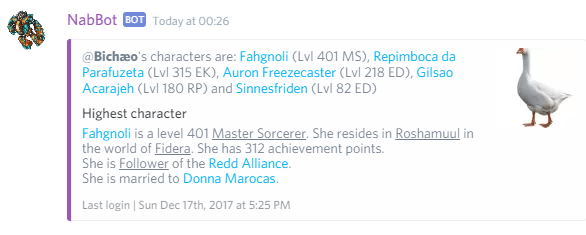  
    In this case, the name only matches a user, and since no character was matched, their highest level registered character is shown.  
    **/whois 115042985778872322**
          
    In this case, a user id was provided, and it searched for the user with that id.

----

## world
**Syntax:** `world <name>`

Shows basic information about a Tibia world.
        
Shows information like PvP type, online count, server location, vocation distribution, and more.

??? Summary "Examples"
    **/world Fidera**    
    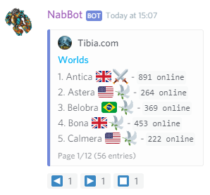  
    **/world Ferobra**  
    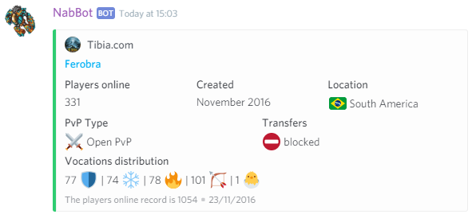

----

## worlds
**Syntax:** `worlds [query]`

Shows a list of worlds.

You can pass a list of parameters separated by commas to change the sorting or filter worlds.

- `online` to sort by online count.
- `descending` to reverse the order.
- `europe`, `south america` or `north america` to filter by location.
- `optional pvp`, `open pvp`, `retro open pvp`, `hardcore pvp` or `retro hardcore pvp` to filter by pvp type.

??? Summary "Examples"
    **/worlds**  
    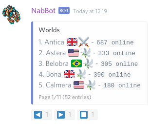  
    **/worlds northamerica,online,descending**  
    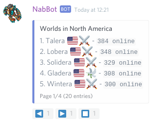  
    **/worlds southamerica,openpvp,online,descending**  
    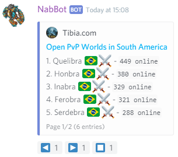    
