Commands related to Tibia, specially commands related to tibia.com

!!! info
    Words in italics are parameters.  
    Parameters enclosed in brackets `[]` are optional.

## /whois
**Syntax:** /whois *playerName/discordUser*  
**Other aliases:** /check, /player, /checkplayer, /char, /character

This commands has 2 functions:  

* It retrieves and displays info about a Tibia character
* It retrieves the list of characters linked to a discord user

If the parameter matches a discord user, it displays a list of the characters linked to that user.
If the parameter matches a character, it will display the character's info, such as level, vocation, guild, world, etc.

If the character found is registered to a discord user, it will show the owner of the character.

Discord users can be looked for through Usernames, User#Discriminator (i.e. `Galarzaa#8515`) or even user id.

Both cases can match simultaneously.

It also shows the character's corresponding highscore positions, however, this is only available for registered characters.

??? summary "Examples"

    **/whois Galarzaa Fidera**  
    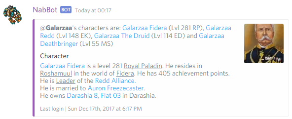
    
    In this case, it matched *Galarzaa Fidera* to a character, and that character is registered to user @Galarzaa
    
    **/whois Galarzaa**  
    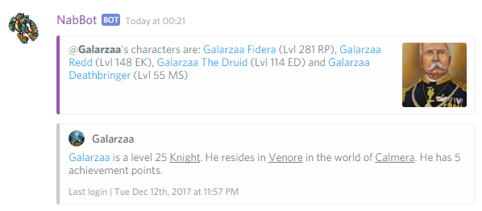
    
    In this case, Galarzaa matches the discord user @Galarzaa, so a list of his registered characters is displayed.
    However, it also matches the character *Galarzaa* which may not be necessarily related to the user.
    
    **/whois Bichæo**  
    
    
    In this case, the name only matches an user, and since no character was matched, their highest level registered character is shown.
    
    **/whois 115042985778872322**
    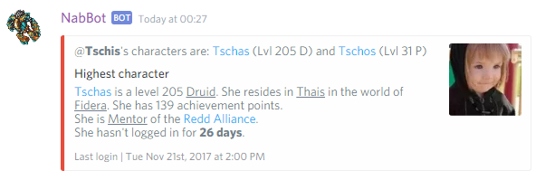
    
    In this case, a user id was provided, and it searched for the user with that id.

---

## /guild
**Syntax:** /guild *guildname*  
**Other aliases:** /guildcheck, /checkguild

Show's the number of members a guild has, and a list of their online users.
It also shows whether the guild has a guildhall or not, and their founded date.

??? summary "Examples"

    **/guild Redd Alliance**  
    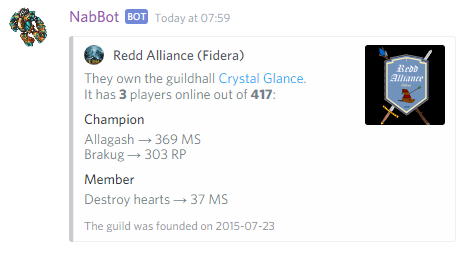

---

### /guild members
**Syntax:** /guild *guildname*  
**Other aliases:** /guild list

Shows a paginated list of all the members of a guild. If they are online, 🔹 is shown next to their name.

??? summary "Examples"
    
    **/guild members Redd Alliance**  
    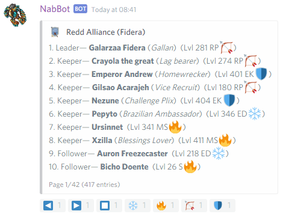
    
---

### /guild info
**Syntax:** /guild info *guildname*  
**Other aliases:** /guild stats

Shows basic information about a guild, like their description, homepage, guildhall, number of members of members and more.

??? summary "Examples"
    
    **/guild info Bald Dwarfs**  
    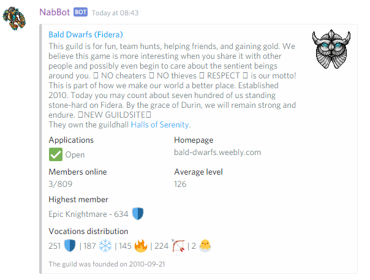

## /share
**Syntax:** /share *level/player*  
**Other aliases:** /expshare, /party

There's three different ways to use this command:

1. Providing a single number, shows the share range of a character of that level.
1. Providing a charater name, shows the share range of that character.
1. Providing up to 5 character names, separated with commas, shows if they are able to share.

??? summary "Examples"

    **/share 300**  
    
    
    **/share Galarzaa Fidera**  
    
    
    **/share Galarzaa Fidera, Nezune, Xzilla**  
    
    
    **/share Galarzaa Fidera, Topheroo**  
    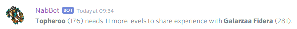

---

## /deaths
**Syntax:** /deaths [*player*]  
**Other aliases:** /deathlist, /death

If a player is specified, it displays a list of that player's recent deaths. 
If no player is specified, it will show the recent deaths of all players registered in the database. 
The number of entries shown per page is higher in ask channel and private channels.

??? Summary "Examples"
      
    **/deaths Xzilla**  
    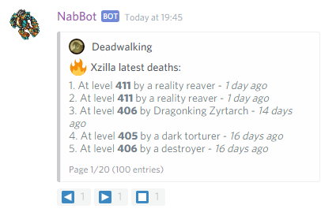
    
    **/deaths**  
    

### /deaths monster
**Syntax:** /deaths monster *name*  
**Other aliases:** /deaths mob, /deaths killer

Shows recent deaths by a specific monster or killer.

??? Summary "Example"
  
    **/deaths mob Lloyd**  
    

### /deaths user
**Syntax:** /death user *name*

Shows recent deaths by all characters registered to a user.

??? Summary "Example"
    
    **/deaths user Nezune**  
    

---

## /levels
**Syntax:** /levels [*player*]  
**Other aliases:** /levelups, /lvl, /level, /lvls

If a player is specified, it displays a list of the player's recent level ups.
If no player is specified, it will show the recent level ups of all players registered in the database.

??? Summary "Examples"

    **/levels**  
    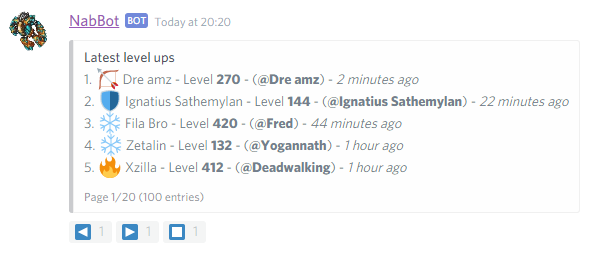
    
    **/levels Dre amz**  
    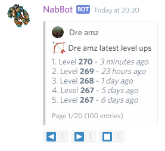

### /levels user
**Syntax:** /levels user *name*  

Shows recent levels by all characters registered to a user.

??? Summary "Examples"
    
    **/levels user Nezune**  
    

---

## /timeline
**Syntax:** /timeline [*player*]  
**Other aliases:** /story

Shows recent levels and deaths by all registered characters.
If a character name is provided, their level ups and deaths are shown. 

* 🌟 Indicates level ups
* 💀 Indicates deaths

??? Summary "Examples"
    
    **/timeline**  
    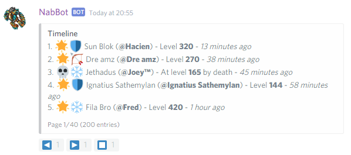
    
    **/timeline Fila Bro**  
    

---

### /timeline
**Syntax:** /timeline user *name*

Shows recent levels and deaths by all characters registed to the user.

??? Summary "Examples"
    
    **/timeline user Pepyto 🍌**  
    

---

## /stats
**Syntax:** /stats *level,vocation*/*charactername*

Replies with the hitpoints, mana, capacity, total experience and experience to next level (at 0% progress) 
of a character with that level and vocation, or if a character's name was entered, it replies with its stats.

??? Summary "Examples"
      
    **/stats 543,elder druid**  
    
        
    **/stats Galarzaa Fidera**  
    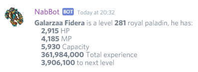

## /findteam
**Syntax:** /findteam *char/level/minlevel*,*maxlevel*  
**Other aliases:** /whereteam, /searchteam, /team

This commands finds registered characters with the desired levels.
Vocations can be filtered using the reaction buttons.

There's three ways to use the command:

1. Provide a character's name, shows a list of characters in share range. (`/findteam char`)
1. Provide a level, shows a list of characters in share range with that level. (`/findteam level`)
1. Provide two levels, shows a list of characters in that level range. (`/findteam min,max`)

Online characters are shown first on the list, they also have a 🔹 icon.

??? Summary "Examples"
    
    **/findteam Galarzaa Fidera**  
    
    
    **/findteam 234**  
    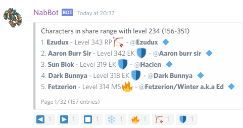
    
    **/findteam 100,120**  
    

---

## /world
**Syntax:** /world *name*

Displays information about a world like pvp type, online count, location and more.

??? Summary "Examples"
    
    **/world Fidera**    
    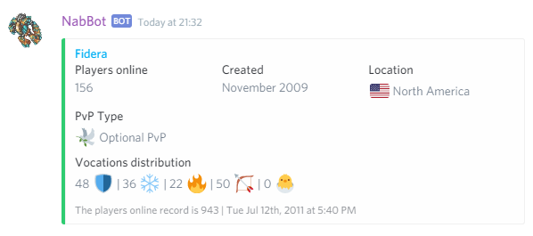
    
    **/world Ferobra**  
    

 
---

## news
**Syntax:** news [*article_id*]

Displays a list of recent news and articles. Or if an article id is provided, a summary of that article is displayed.

If the command is used on the ask channel or in private, the list or summary displayed will be longer.

??? Summary "Examples"

    **/news**    
    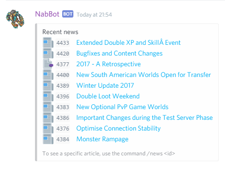
    
    **/news 4400**  
    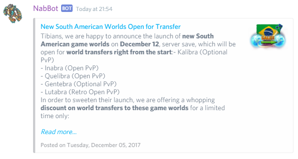

## /house
**Syntax:** /house *name*[/*world*]  
**Other aliases:** /houses, /guildhall, /gh

Displays information about a house, including a picture of the a section of the map where it is located.
It shows the current status of the house in the world the current discord server is tracking.

To specify a different world, add the world after a slash `/`

??? Summary "Examples"
    
    **/house darashia 8, flat 03**  
    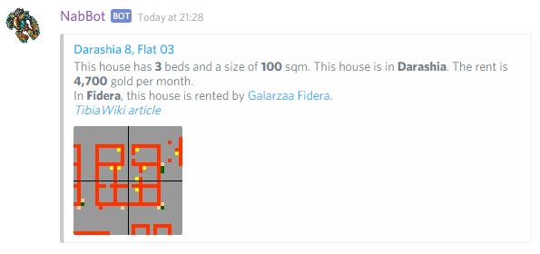
      
    **/house caveman shelter/calmera**  
    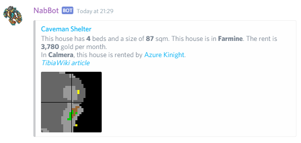

----

## /blessings
**Syntax:** /blessings *level*  
**Other aliases:** /bless

Replies with the cost of blessings for that level.
For players over level 100, it will also display the cost of the Blessing of the Inquisition.

??? Summary "Examples"
  
    **/bless 90**  
    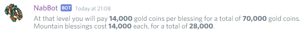
    
    **/bless 140**  
    

----

## /time
**Other aliases:** /serversave, /ss

Displays the time in CipSoft's (CET/CEST), Brazil's and Mexico's timezones, the time until server save and Rashid's current city.

??? Summary "Examples"
    
    **/time**  
    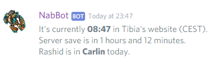
