All the commands that use information from TibiaWiki.  
Information is read from `tibia_database.sql`, which is generated from [tibiawiki-sql](https://github.com/Galarzaa90/tibiawiki-sql).

!!! info
    Words in italics are parameters.  

## /itemprice
**Syntax:** /itemprice *name*  
**Other aliases:** /checkprice, /item

Shows information about an item, their attributes, NPCs that buy and/or sell it (only for the best price), and creatures that drop it and quest where it's given as reward.

The embed's sidebar color shows if a major loot NPC buys it so it can be noted at quick glance.
Yellow for Rashid, Blue and Green for Djinns and Purple for gems.

The answer given may be shortened to avoid spam in chats. 
For longer replies, the command must be used in the ask channel or via private message.

??? summary "Examples"
    
    **/item dragon scale mail**  
    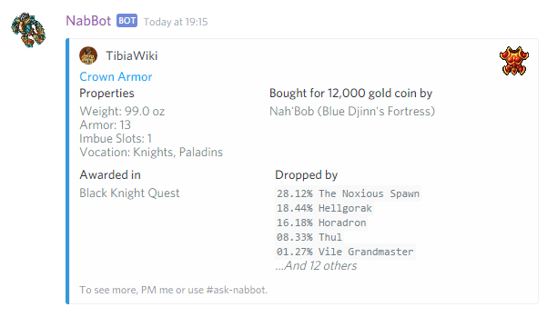
    
    *When used on the ask-channel or private message*  
    **/item dragon scale mail**  
    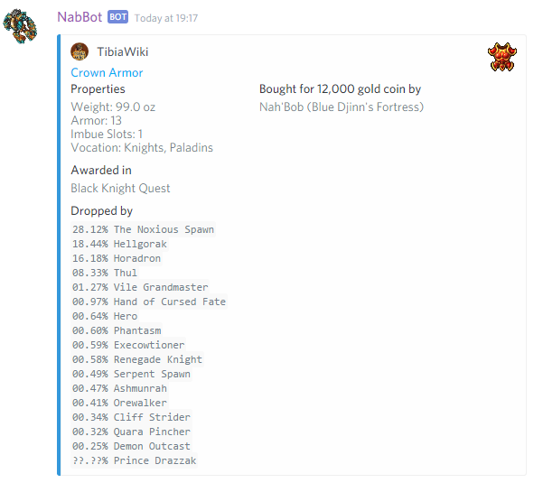

---

## /monster
**Syntax:** /monster *name*
**Other aliases:** /mob, /creature, /mon

Displays information about a specific creature. Health points, experience, resistances and weaknesses, loot drops, etc.

If used on the ask-channel or private message, the information displayed is longer.

??? summary "Examples"

    **/monster Demon** *(On a regular channel)*  
    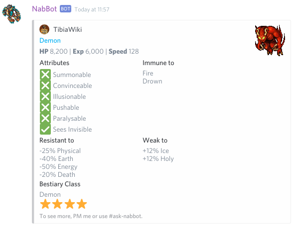
    
    **/monster Demon** *(On an ask channel or private message)*  
    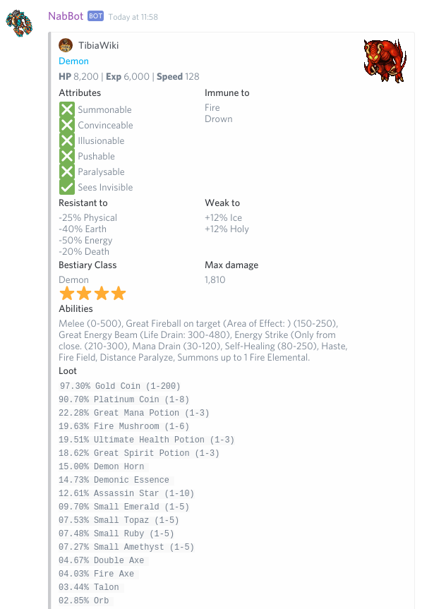
    
    (*The bottom of the image has been cropped*)

----

## /spell
**Syntax:** /spell *name/words*

Replies with information on a certain spell like level, vocation(s) required, level required, cost and NPCs that sell it.
Information given is shorter unless it's used in the ask channel or private messages.

??? summary "Examples"

    **/spell exori gran**  
    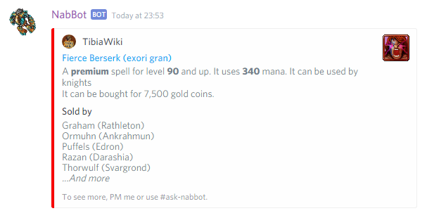
    
    **/spell emberwing**  
    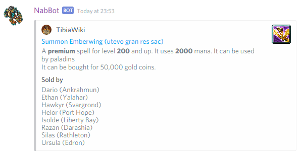

----

## /npc *name*
**Syntax:** /npc *name*  
**Other aliases:** /npcs

Shows information about an NPC. What items do they sell and buy, where are they found and travel destinations.
More information is displayed if used on the ask channel or on private messages.

??? summary "Examples"

    **/npc rashid** *(On a regular channel)*  
    
    
    **/npc captain fearless**  *(On an ask channel or private message)*  
    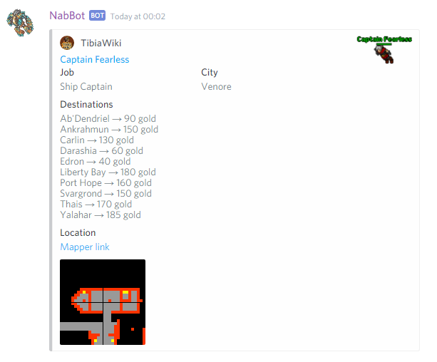

----

## /achievements
**Syntax:** /achievements *name*  
**Other aliases:** /achiev

Shows information about an achievement.

??? summary "Examples"

    **/achievement demonic barkeeper**  
    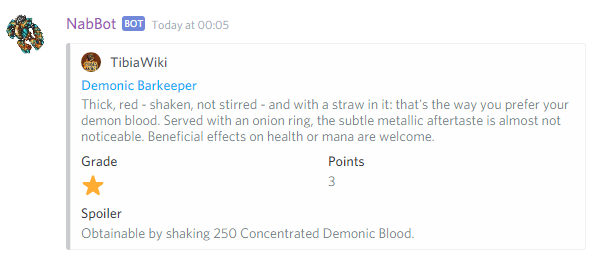
    
----

## /key
**Syntax:** /key *number*  
**Other aliases:** /keys

Shows information about a key with a certain number.

??? summary "Examples"

    **/key 3940**  
    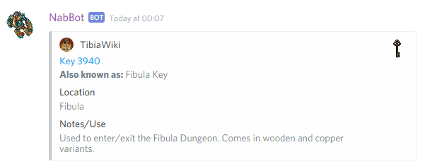
    
----

### /key search
**Syntax:** /key search *name*

Searches for keys by keyword. The keyboard might be their common name or the place they're used in.
If there are multiple coincidences, a list is shown. If only one, the key's information is shown directly.

??? summary "Examples"

    **/key search hellgate** *(only one match)*  
    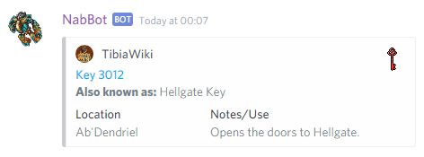
    
    **/key search fibula** *(multiple matches)*  
    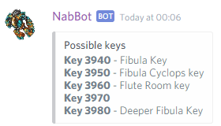
    
    