# TibiaWiki commands

All the commands that use information from TibiaWiki.  
The information is read generated using [tibiawiki-sql](https://github.com/Galarzaa90/tibiawiki-sql).

!!! info
    Parameters are enclosed with `< >`.   
    Optional parameters are enclosed in brackets `[]`.

## achievement
**Syntax:** `achievement <name>`  
**Other aliases:** `achiev`

Displays an achievement's information.

Shows the achievement's grade, points, description, and instructions on how to unlock.

??? summary "Examples"
    **/achievement demonic barkeeper**  
    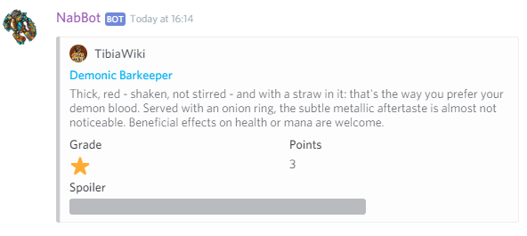

----

## charm
**Syntax:** `charm [name]`

Displays information about a charm.

If no name is specified, displays a list of all charms for the user to choose from.

??? summary "Examples"
    **/charm**  
    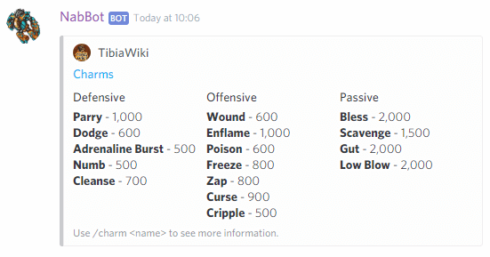  
    **/charm zap**  
    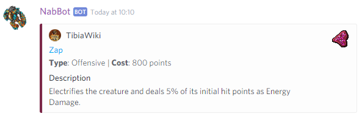

----

## imbuement
**Syntax:** `imbuement <name>[,price1[,price2[,price3]]][,tokenprice]`  
**Other aliases:** `imbue`

Displays information about an imbuement.

You can optionally provide prices for the materials, in the order of the tier they belong to.
Additionally, for Vampirism, Void and Strike imbuements, you can provide the price for gold tokens.

The total cost will be calculated, as well as the hourly cost.
If applicable, it will show the cheapest way to get it using gold tokens.

It can also accept prices using the 'k' suffix, e.g. 1.5k

??? summary "Examples"
    **/imbuement powerful void,2.2k,3790,2995,35.8k**  
    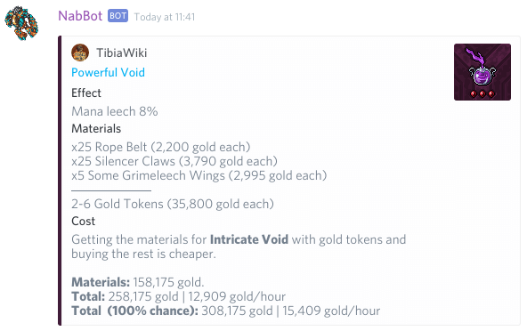  
    **/imbuement intricate slash**  
    

----

## bestiary
**Syntax:** `bestiary <class>`

Displays a category's creatures or all the categories.

If a category is specified, it will list all the creatures that belong to the category and their level.
If no category is specified, it will list all the bestiary categories.

??? summary "Examples"
    **/bestiary**  
    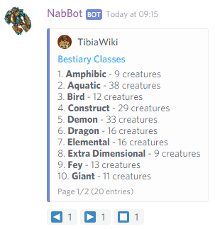  
    **/bestiary dragon**  
    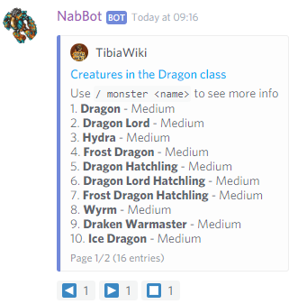

----

## item
**Syntax:** `item <name>`  
**Other aliases:** `itemprice`

Displays information about an item.

Shows who buys and sells the item, what creatures drops it and many attributes.
        
The embed is colored if a major loot NPC buys it, so it can be noted at quick glance.  
Yellow for Rashid, Blue and Green for Djinns and Purple for gems.
        
More information is shown if used in private messages or in the command channel.

??? summary "Examples"
    **/item dragon scale mail**  
    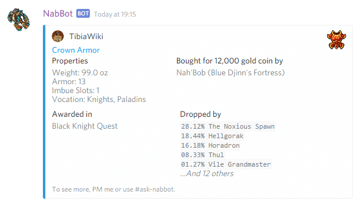  
    *When used on the ask-channel or private message*  
    **/item dragon scale mail**  
    

----

## key
**Syntax:** `key <number>`  

Displays information about a key.

Shows the key's known names, how to obtain it and its uses.

??? summary "Examples"
    **/key 3940**  
    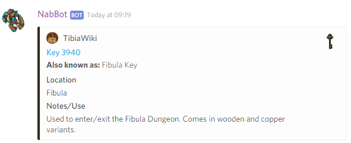

----

### key search
**Syntax:** `key search <name>`

Searches for a key by keywords.

Search for matches on the key's names, location, origin or uses.

if there are multiple matches, a list is shown.
If only one matches, the key's information is shwon directly.

??? summary "Examples"
    **/key search hellgate** *(only one match)*  
    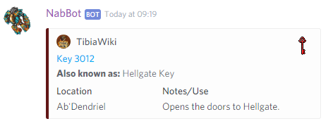  
    **/key search fibula** *(multiple matches)*  
    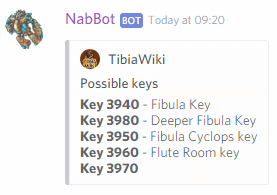

----
    
## monster
**Syntax:** `monster <name>`  
**Other aliases:** `mob`, `creature`

Displays information about a monster.

Shows the monster's attributes, resistances, loot and more.

More information is displayed if used on a private message or in the command channel.

??? summary "Examples"
    **/monster Demon** *(On a regular channel)*  
    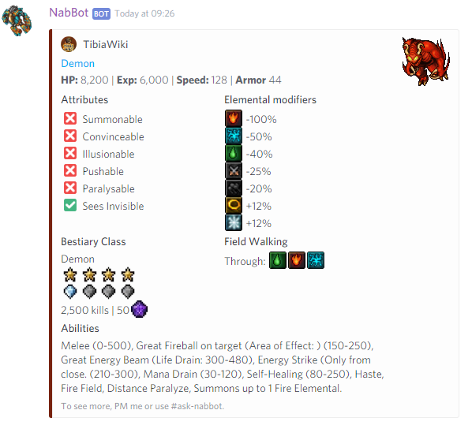  
    **/monster Demon** *(On an ask channel or private message)*  
    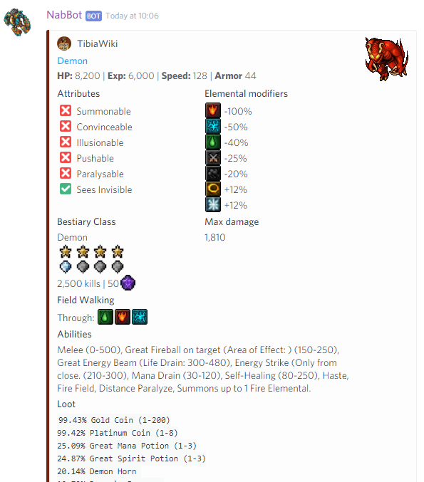  
    (*The bottom of the image has been cropped*)

----

## npc
**Syntax:** `npc <name>`

Displays information about a NPC.

Shows the NPC's item offers, their location and their travel destinations.
        
More information is displayed if used on private messages or the command channel.

??? summary "Examples"
    **/npc rashid** *(On a regular channel)*  
      
    **/npc captain fearless**  *(On an ask channel or private message)*  
    

----

## rashid
Shows where Rashid is today.

For more information, use `npc Rashid`.

??? summary "Examples"
    **/rashid**  
    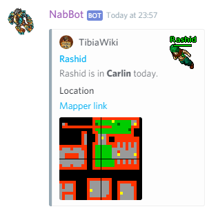

----

## spell
**Syntax:** `spell <name/words>`

Displays information about a spell.

Shows the spell's attributes, NPCs that teach it and more.
        
More information is displayed if used on private messages or the command channel.

??? summary "Examples"
    **/spell exori gran**  
    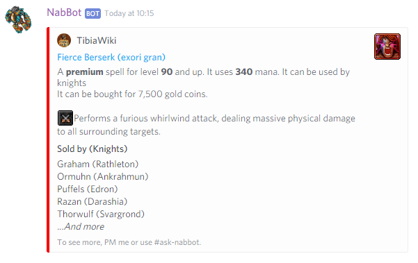  
    **/spell emberwing**  
    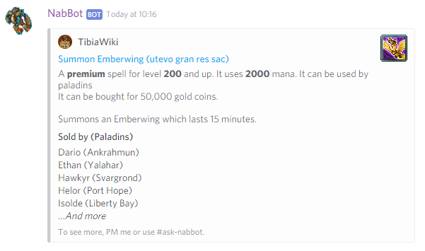

----

## wikistats
**Other aliases:** `wikiinfo`

Shows information about the TibiaWiki database.

??? summary "Examples"
    **/wikinfo**  
    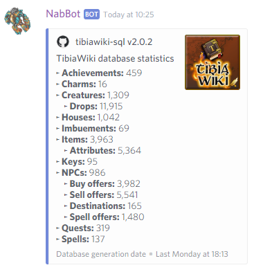