# Timers commands

----
## boss
**Syntax:** `boss <name>` 

Shows the remaining cooldown time for a specific boss.

??? Summary "Examples"
    **/boss lloyd**  
    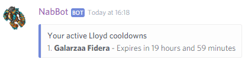

----

### boss bosslist
Shows a list of supported boss cooldowns.

??? Summary "Examples"
    **/boss bosslist**  
    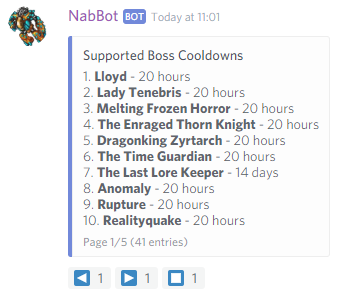

----

### boss list
Shows a list of all your active cooldowns.

For privacy reasons, only characters matching the tracked world of the current server will be shown.
To see all your characters, try it on a private message.
    

## events
**Other aliases:** `event` 

Shows a list of upcoming and recent events.

??? Summary "Examples"
    **/event**  
    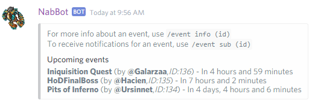

----
   
### events add
**Syntax:** `events add <starts in> <name>[,description]`

Creates a new event.

`starts in` is in how much time the event will start from the moment of creation.
This is done to avoid dealing with different timezones.
Just say in how many days/hours/minutes the event is starting.

The time can be set using units such as 'd' for days, 'h' for hours, 'm' for minutes and 'd' for seconds.
Examples: 1d20h5m, 1d30m, 1h40m, 40m

The event description is optional, you can also use links like: `[link title](link url)`.

Once the event is created, the id of the event will be returned. This is used for further edits.

??? Summary "Example"
    **/event add 5h Inquisition Quest,Remember to bring holy water!**  
    **`[TibiaWiki link](http://tibia.wikia.com/wiki/Inquisition_quest)`**  
    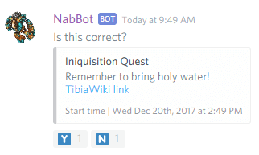

----

### event addplayer
**Syntax:** `event addplayer <id> <character>`  
**Other aliases:** `event addchar`

Adds a character to an event.

Only the creator can add characters to an event.
If the event is joinable, anyone can join an event using `event join`

??? Summary "Examples"
    **/event addplayer 136 Nezune**  
    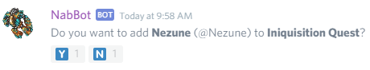

----

### event edit

Use the subcommands to edit the event's properties.
Only the creator of the event and mods can edit an event.
Past events can't be edited.

----

#### event edit description
**Syntax:** `event edit description <id> [new description]`  
**Other aliases:** `event edit desc`, `event edit details`

Edits an event's description.
        
If no new description is provided initially, the bot will ask for one.  
To remove the description, say `blank`.

----

#### event edit joinable 
**Syntax:** `event edit joinable <id> [yes/no]`  
**Other aliases:** `event edit open`

Changes whether anyone can join an event or only the owner may add people.

If an event is joinable, anyone can join using `event join`  .
Otherwise, the event creator has to add people with `event addplayer`.

----

#### event edit name
**Syntax:** `event edit name <id> [new name]`  
**Other aliases:** `event edit title`

Edit's an event's name.

If no new name is provided initially, the bot will ask for one.

----

#### event edit slots
**Syntax:** `event edit slots <id> [new slots]`  
**Other aliases:** `event edit size`

Edits an event's number of slots

Slots is the number of characters an event can have. By default this is 0, which means no limit.

----

#### event edit time
**Syntax:** `event edit time <id> [new start time]`

Edit's an event's start time.

If no new time is provided initially, the bot will ask for one.

----

### events info
**Syntax:** `events info <id>`

Displays an event's info.

The start time shown in the footer is always displayed in your device's timezone.
  
??? Summary "Examples"
    **/event info 136**  
    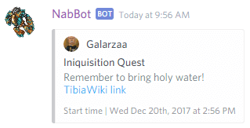

----
    
### event join
**Syntax:** `event join <id> <char>`

Join an event with a specific character

You can only join an event with a character at a time.  
Some events may not be joinable and require the creator to add characters themselves.

??? Summary "Examples"
    **/event join 136 Galarzaa Fidera**  
    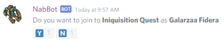

----
    
### event leave
**Syntax:** `event leave <id>`

Leave an event you were participating in.

??? Summary "Examples"
    **/event leave 136**  
    

----

### event make

Creates an event guiding you step by step

Instead of using confusing parameters, commas and spaces, this commands has the bot ask you step by step.

----

### event participants
**Syntax:** `event participants <id>`

Shows the list of characters participating in this event.

??? Summary "Examples"
    **/event participants 190**  
    

----

### event remove
**Syntax:** `event <id>`  
**Other aliases:** `event delete`, `event cancel`

Deletes or cancels an event.

??? Summary "Examples"
    **/event delete 136**  
    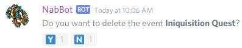

----

### event removeplayer
**Syntax:** `event removeplayer <id> <character>`  
**Other aliases:** `event removechar`

Removes a player from an event.

Players can remove themselves using `event leave`

??? Summary "Examples"
    **/event addplayer 136 Nezune**  
    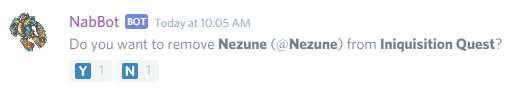

----

### event subscribe
**Syntax:** `event subscribe <id>`  
**Other aliases:** `event sub`

Subscribe to receive a PM when an event is happening.

??? Summary "Examples"
    **/event sub 136**  
    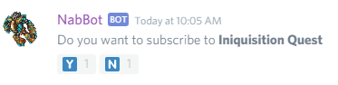

----

### event unsubscribe
**Syntax:** `event unsubscribe id`  
**Other aliases:** `event unsub`

Unsubscribes you from an event.

??? Summary "Examples"
    **/event unsub 136**  
    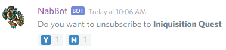