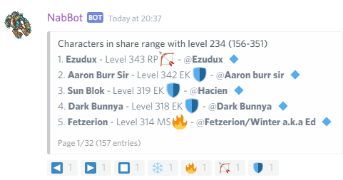
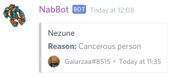

# Tracking commands

Commands related to NabBot's tracking functions.

!!! info
    Parameters are enclosed with `< >`.   
    Optional parameters are enclosed in brackets `[]`.

## claim
**Syntax:** `claim <name>`

Claims a character as yours, even if it is already registered to someone else.

In order for this to work, you have to put a special code in the character's comment.
You can see this code by using the command with no parameters. The code looks like this: `/NB-23FC13AC7400000/`

Once you had set the code, you can use the command with that character, if the code matches, it will be reassigned to you.
Note that it may take some time for the code to be visible to NabBot because of caching.

This code is unique for your discord user, so the code will only work for your discord account and no one else.
No one can claim a character of yours unless you put **their** code on your character's comment.

----

## im
**Syntax:** `im <characterName>`  
**Other aliases:** `i'm`, `iam`

Lets you add your tibia character(s) for the bot to track.

The bot scans the character and other characters on the account and registers them to the user.
Registered characters have their deaths and level ups announced on the chat.

The bot will skip characters on different worlds than the world the discord server tracks.
Also, if it finds a character owned by another user, the whole process will be stopped.

If a character is already registered to someone else, [/claim](#claim) can be used.

??? Summary "Example"
    **/im Elf**  
    

----

## imnot
**Syntax:** `imnot <characterName>`  
**Other aliases:** `i'mnot`

Removes a character assigned to you

All registered level ups and deaths will be lost forever.

??? Summary "Example"
    **/imnot tomas haake**  
    

----

## online

Tells you which users are online on Tibia.

This list gets updated based on Tibia.com online list, so it takes a couple minutes to be updated.

??? Summary "Example"
    **/online**  
    

----

## searchteam
**Syntax:** `searchteam <name>` or `searchteam <level>` or `searchteam <min>,<max>`  
**Other aliases:** `whereteam`, `findteam`

Searches for a registered character that meets the criteria

There are 3 ways to use this command:

- Show characters in share range with a specific character. (`searchteam <name>`)
- Show characters in share range with a specific level. (`searchteam <level>`)
- Show characters in a level range. (`searchteam <min>,<max>`)

Online characters are shown first on the list, they also have an icon next to them.

??? Summary "Examples"
    **/searchteam Galarzaa Fidera**  
      
    **/searchteam 234**  
      
    **/searchteam 100,120**  
    

----

## watched
**Syntax:** `watched  [name]`  
**Other aliases:** `watchlist`, `huntedlist`

Sets the watched list channel for this server

Creates a new text channel for the watched list to be posted.

The watch list shows which characters from it are online. Entire guilds can be added too.

If no name is specified, the default name "watched-list" is used.

When the channel is created, only the bot and people with `Administrator` role can read it.  
The permissions can be adjusted afterwards.

The channel can be renamed at anytime without problems.

??? Summary "Examples"
    **/watched**  
      
    **Initial message shown in the channel**
      
    **Message once characters and/or guilds have been added**  
    

----

### watched add
**Syntax:** `watched add <name>[,reason]` 
**Other aliases:** `watched addplayer`, `watched addchar`

Adds a character to the watched list.

A reason can be specified by adding it after the character's name, separated by a comma.

??? Summary "Examples"
    **/watched add Galarzaa Fidera**  
    

----
    
### watched addguild
**Syntax:** `watched addguild <name>[,reason]`

Adds an entire guild to the watched list.

Guilds are displayed in the watched list as a group.

??? Summary "Examples"
    **/watched addguild Redd Alliance**  
    

----

### watched info
**Syntax:**: `watched info <name>`  
**Other aliases:** `watched details`, `watched reason`

Shows information about a watched list entry.

This shows who added the player, when, and if there's a reason why they were added.

??? Summary "Examples"
    **/watched info Nezune**  
    

----

### watched infoguild
**Syntax:**: `watched info <name>`  
**Other aliases:** `watched detailsguild`, `watched reasonguild`

Shows details about a guild entry in the watched list.
        
This shows who added the player, when, and if there's a reason why they were added.

----

### watched list

Shows a list of all watched characters

Note that this lists all characters, not just online characters.

??? Summary "Examples"
    **/watched list**  
    

----

### watched listguilds
**Other aliases:** `watched guilds`, `watched guildlist`

Shows a list of all guilds currently in the list.

??? Summary "Examples"
    **/watched guildlist**  
    

----

### watched remove
**Syntax:** `watched remove <name>`  
**Other aliases:** `watched removeplayer`, `watched removechar`

Removes a character from the watched list.

??? Summary "Examples"
    **/watched remove Kaiizokuo**  
    

----  

### watched removeguild
**Syntax**:  `watched removeguild <name>`

Removes a guild from the watched list.

??? Summary "Examples"
    **/watched removeguild Redd Alliance**  
    

