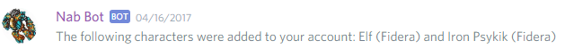
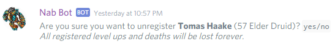
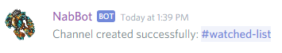
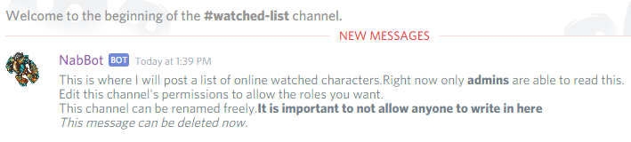
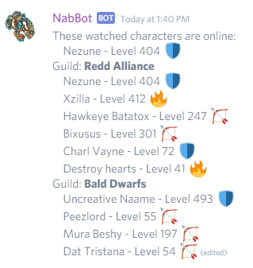
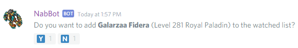
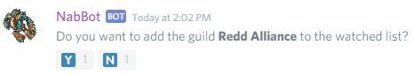
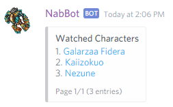
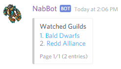

Commands related to NabBot's tracking functions.

!!! info
    Words in italics are parameters.  
    Parameters enclosed in brackets `[]` are optional.

## /im characterName

The bot scans the character and other characters on the account and registers them to the user.
Registered characters have their deaths and level ups announced on the chat.

The bot will skip characters on different worlds than the world the discord server tracks.
Also, if it finds a character owned by another user, the whole process will be stopped.

??? Summary "Example"

    **/im Elf**  
    

----

## /imnot characterName

Unregisters a character you previously registered.

??? Summary "Example"
  
    **/imnot tomas haake**  
    

----

## /online

Shows a list of tracked characters that are online, along with their level, vocation and owner.

The list is shown with pages and vocation filter.

??? Summary "Example"
  
    **/online**  
    

----

## /watched *[name]*
*Other aliases: /watchlist, /hunted, /huntedlist*

Creates a new text channel for the watched list to be posted. The watch list shows which characters from it are online.
Entire guilds can be added too.

If no name is specified, the default name `#hunted-list` will be used.

When the channel is created, only NabBot and people with `Administrator` permissions can read it.
You can change the permissions to whatever you see fit afterwards.

The channel may be renamed at anytime without problems. But if it's deleted, it must be created again using the command.

??? Summary "Examples"
  
    **/watched**  
    
    
    **Initial message shown in the channel**
    
    
    **Message once characters and/or guilds have been added**
    

----

### /watched add *name*
*/Other aliases: /watched addplayer, /watched addchar*

Adds a character to the character list. The character must be in the same world the server is tracking.

The bot asks for confirmation before adding, by using emoji reactions: 🇾/🇳.

??? Summary "Examples"
  
    **/watched add Galarzaa Fidera**  
    
    
----

### /watched remove *name*
*/Other aliases: /watched removeplayer, /watched removechar*

Removes a character from the watched list.

The bot asks for confirmation before adding, by using emoji reactions: 🇾/🇳.

??? Summary "Examples"
  
    **/watched remove Kaiizokuo**  
    
    
    
### /watched addguild *name*

Adds a guild to the watched list. Every online members will be listed on the list.

The bot asks for confirmation before adding, by using emoji reactions: 🇾/🇳.

??? Summary "Examples"
  
    **/watched addguild Redd Alliance**  
    

----
    
### /watched removeguild *name*

Removes a guild from the watched list.

The bot asks for confirmation before adding, by using emoji reactions: 🇾/🇳.

??? Summary "Examples"
  
    **/watched removeguild Redd Alliance**  
    

----
    
### /watched list

Shows a list of all characters currently in the list.

??? Summary "Examples"
  
    **/watched list**  
    

----
    
### /watched guildlist
*Other aliases: /watched guilds, /watched listguilds*

Shows a list of all guilds currently in the list.

??? Summary "Examples"
  
    **/watched guildlist**  
    
    
