# Tracking commands

Commands related to NabBot's tracking functions.

!!! info
    Parameters are enclosed with `< >`.   
    Optional parameters are enclosed in brackets `[]`.

----

## addchar
**Syntax:** `addchar <user>,<character>`

Register a character and optionally all other visible characters to a discord user.
        
This command can only be used by server moderators.

If a character is hidden, only that character will be added. Characters in other worlds are skipped.

----

## claim
**Syntax:** `claim <name>`

Claims a character as yours, even if it is already registered to someone else.

In order for this to work, you have to put a special code in the character's comment.
You can see this code by using the command with no parameters. The code looks like this: `/NB-23FC13AC7400000/`

Once you had set the code, you can use the command with that character, if the code matches, it will be reassigned to you.
Note that it may take some time for the code to be visible to NabBot because of caching.

This code is unique for your discord user, so the code will only work for your discord account and no one else.
No one can claim a character of yours unless you put **their** code on your character's comment.

----

## im
**Syntax:** `im <characterName>`  
**Other aliases:** `i'm`, `iam`

Lets you add your tibia character(s) for the bot to track.

The bot scans the character and other characters on the account and registers them to the user.
Registered characters have their deaths and level ups announced on the chat.

The bot will skip characters on different worlds than the world the discord server tracks.
Also, if it finds a character owned by another user, the whole process will be stopped.

If a character is already registered to someone else, [/claim](#claim) can be used.

??? Summary "Example"
    **/im Elf**  
    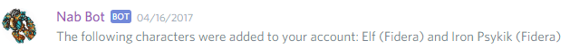

----

## imnot
**Syntax:** `imnot <characterName>`  
**Other aliases:** `i'mnot`

Removes a character assigned to you

All registered level ups and deaths will be lost forever.

??? Summary "Example"
    **/imnot tomas haake**  
    

----

## online

Tells you which users are online on Tibia.

This list gets updated based on Tibia.com online list, so it takes a couple minutes to be updated.

??? Summary "Example"
    **/online**  
    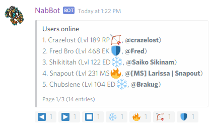

----

## removechar
**Syntax:** `removechar <character>`

Removes a registered character from someone.
        
This can only be used by server moderators.

Note that you can only remove chars if they are from users exclusively in your server.
You can't remove any characters that would alter other servers NabBot is in.

----

## searchteam
**Syntax:** `searchteam <name>` or `searchteam <level>` or `searchteam <min>,<max>`  
**Other aliases:** `whereteam`, `findteam`

Searches for a registered character that meets the criteria

There are 3 ways to use this command:

- Show characters in share range with a specific character. (`searchteam <name>`)
- Show characters in share range with a specific level. (`searchteam <level>`)
- Show characters in a level range. (`searchteam <min>,<max>`)

Online characters are shown first on the list, they also have an icon next to them.

??? Summary "Examples"
    **/searchteam Galarzaa Fidera**  
      
    **/searchteam 234**  
    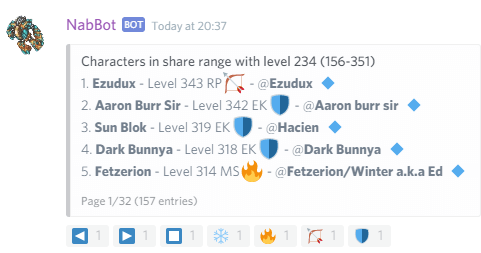  
    **/searchteam 100,120**  
    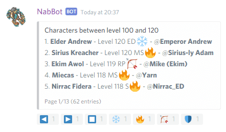

----

## watchlist
**Other aliases:** `huntedlist`

Create or manage watchlists.

Watchlists are channels where the online status of selected characters are shown.
You can create multiple watchlists and characters and guilds to each one separately.

Try the subcommands.

----

### watchlist add
**Syntax:** `watchlist add <channel> <name>[,reason]` 
**Other aliases:** `watchlist addplayer`, `watchlist addchar`

Adds a character to a watchlist.

A reason can be specified by adding it after the character's name, separated by a comma.

??? Summary "Examples"
    **/watchlist add #friends Galarzaa Fidera**  
    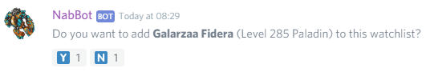  
    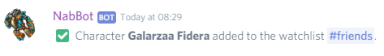

----
    
### watchlist addguild
**Syntax:** `watchlist addguild <channel> <name>[,reason]`

Adds an entire guild to the watchlist.

Guilds are displayed in the watchlist as a group.

??? Summary "Examples"
    **/watchlist addguild #friends Bald Dwarfs**  
    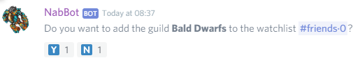  
    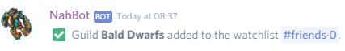

----    

### watchlist adduser
**Syntax:** `watchlist adduser <channel> <user>[,reason]`

Adds the currently registered characters of a user to the watchlist.

A reason can be specified by adding it after the character's name, separated by a comma.

??? Summary "Examples"
    **/watchlist adduser #friends Deadwalking**  
    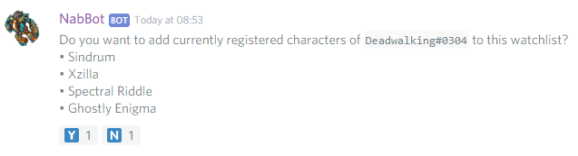

----

### watchlist create
**Syntax:** `watchlist create <name>`  

Creates a watchlist channel.

Creates a new text channel for the watchlist to be posted.

The watch list shows which characters from it are online. Entire guilds can be added too.

The channel can be renamed at anytime. If the channel is deleted, all its entries are deleted too.

??? Summary "Examples"
    **/watchlist create friends**  
    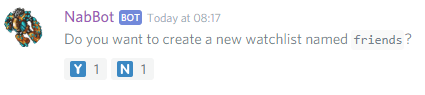  
    **Initial message shown in the channel**  
    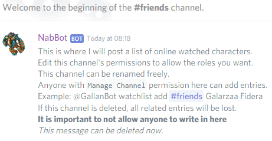  
    **Message once characters and/or guilds have been added**  
    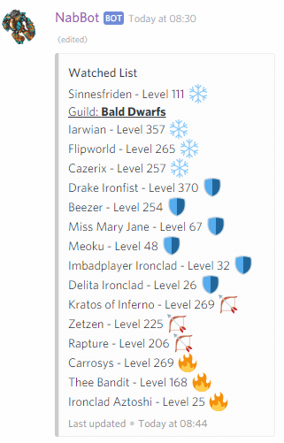

----

### watchlist info
**Syntax:** `watchlist info <channel> <name>`  
**Other aliases:** `watchlist details`, `watchlist reason`

Shows information about a watchlist entry.

This shows who added the player, when, and if there's a reason why they were added.

??? Summary "Examples"
    **/watchlist info #enemies Nezune**  
    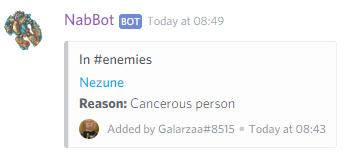

----

### watchlist infoguild
**Syntax:** `watchlist info <channel> <name>`  
**Other aliases:** `watchlist detailsguild`, `watchlist reasonguild`

Shows details about a guild entry in a watchlist.
        
This shows who added the player, when, and if there's a reason why they were added.

??? Summary "Examples"
    **/watchlist #enemies info Nezune**  
    

----

### watchlist list
**Syntax:** `watchlist list <channel>`

Shows characters belonging to that watchlist.

Note that this lists all characters, not just online characters.

??? Summary "Examples"
    **/watchlist #friends list**  
    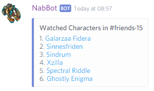

----

### watchlist listguilds
**Syntax:** `watchlist listguilds <channel>`  
**Other aliases:** `watchlist guilds`, `watchlist guildlist`

Shows a list of guilds in the watchlist.

??? Summary "Examples"
    **/watchlist guildlist**  
    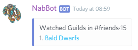

----

### watchlist remove
**Syntax:** `watchlist remove <channel> <name>`  
**Other aliases:** `watchlist removeplayer`, `watchlist removechar`

Removes a character from the watchlist.

----  

### watchlist removeguild
**Syntax:**  `watchlist removeguild <channel> <name>`

Removes a guild from the watchlist.

----

### watchlist showcount
**Syntax:** `watchlist <channel> <yes|no>`

Changes whether the online count will be displayed in the watchlist's channel's name or not.
