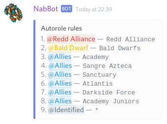

# Automatic roles
Automatic roles let you link Tibia guilds with specific roles, to aid you in categorizing or controlling access to your server.

To see the related commands check the [Roles commands](../commands/roles.md#autorole).

These features require the bot to have `Manage Roles` permission, as this is required to be able to add and remove roles.

Only users with `Manage Roles` permissions can edit and check rules, and they can't edit any rules for roles higher than theirs.

## Adding rules
Automatic roles work based on rules. A rule consist of a role and a guild.
When a user has a registered character in a guild contained in a rule, the role is added.
If that character leaves the guild or the user unregisters the character, their role will be removed, unless they met another rule for that role.

Rules can be added by using *[autorole add](../commands/roles.md#autorole-add)*. The command takes two parameters: A role and a guild.

!!! Summary "Examples"
    - `/autorole add @Redd Alliance Redd Alliance` – Members of Redd Alliance will receive the role `@Redd Alliance`.
        Note that @Redd Alliance must be mentionable to be added this way, and it will ping all role members.
    - `/autorole add 162767187474513920 Redd Retreat` – Members of Redd Retreat will receive the role with id `162767187474513920`.
        Role ids can be obtained by using *[roleinfo](../commands/roles.md#roleinfo)*.
    - `/autorole add "Bald Dwarfs" Bald Dwarfs` – Members of Bald Dwarfs will receive the role `@Bald Dwarfs`.
        Note that since the role name contains multiple words, it must be quoted. Guilds never need to be quoted.
    - `/autorole add Identified *` – Any user that has registered character will be given the `@Identified` role.
    
You can have as many rules as you want, for as many roles or guilds as needed, as long as they're not repeated.

It is also possible to have multiple rules for the same roles. In practice, this can be used to have a `@Allies` role.
All the allied guilds would be added to the same role.

The list of rules can be checked using *[autorole list](../commands/roles.md#autorole-list)*.

## Applying rules
Once the rules have been set, NabBot will start enforcing them whenever certain triggers are actioned:

- A new member joins the server, with previously registered characters.
- A member uses `/im` to register characters.
- A member uses `/imnot` to unregister characters.
- A registered character is checked using `/whois` and a guild change is detected.
- A registered character is checked while online in the level and deaths tracking process.

## Limitations
- If a rule is removed, there's currently no way to "undo" that rule, e.g. if the rule for @Guildies is removed,
NabBot won't remove the role from any users, *unless* there's another rule involving that rule that they don't meet.
- Unless checked using `/whois`, there is no way to apply rules to characters that haven't been online in a while.
Meaning that an old inactive member that was kicked from a guild, won't have their role removed until they log in or they are check with `/whois`.
- If an automatic role is assigned/removed manually by someone, the bot might remove/reassign it again when the character is checked.
- Newly added rules are not applied for existing members until a character change is detected.
Using *[autorole refresh](../commands/roles.md#autorole-refresh)* will check all members again.
Note that this won't update characters that haven't been online in a while.
The refresh and update of roles takes a long time due to discord API limitations.